# Lab5

# 练习0:填写已有实验

对实验4的proc.c中的代码进行进一步改进。

## alloc_proc函数

更新的部分为初始化进程的等待状态和进程关系指针：`wait_state`设为 0，`cptr`、`yptr`、`optr`设为 NULL。
```c
static struct proc_struct *
alloc_proc(void)
{
    struct proc_struct *proc = kmalloc(sizeof(struct proc_struct));
    if (proc != NULL)
    {
        proc->state = PROC_UNINIT;  // 刚分配，状态为未初始化
        proc->pid = -1;             // -1 表示还没有分配具体的 PID
        proc->runs = 0;             // 还没运行过，为 0
        proc->kstack = 0;           // 内核栈还没分配，先置 0
        proc->need_resched = 0;     // 不需要调度
        proc->parent = NULL;        // 没有父进程
        proc->mm = NULL;            // 内存管理结构暂时为空（内核线程通常共享内核 mm，或者之后才分配）
        // context 是一个结构体，里面全是寄存器，必须清零
        memset(&(proc->context), 0, sizeof(struct context));        
        proc->tf = NULL;            // 中断帧指针置空
        proc->pgdir = boot_pgdir_pa;// 页表基址赋值为内核页表基址，默认共享内核页表，用户进程会在do fork中覆盖
        proc->flags = 0;            // 标志位清零
        // 名字清零
        memset(proc->name, 0, PROC_NAME_LEN + 1);


        // LAB5更新: 初始化等待状态和进程关系指针
        proc->wait_state = 0;         
        proc->cptr = NULL;            
        proc->yptr = NULL;            
        proc->optr = NULL;            
    }
    return proc;
}
```

## do_fork函数
更新的部分包括步骤1与步骤5：在步骤 1 中，将子进程的`parent` 设为` current`，并用`assert`确保`current->wait_state`为 0，确保父进程不在等待状态，可以正常 fork。在步骤 5 中，改为调用`set_links(proc)`，该函数会将进程加入`proc_list`，并建立父子与兄弟关系（设置`cptr`、`optr`、`yptr`）、增加全局进程计数。
```c
int do_fork(uint32_t clone_flags, uintptr_t stack, struct trapframe *tf)
{
    int ret = -E_NO_FREE_PROC;
    struct proc_struct *proc;
    if (nr_process >= MAX_PROCESS)
    {
        goto fork_out;
    }
    ret = -E_NO_MEM;
    proc=alloc_proc();
    if(proc == NULL)
    {
        goto fork_out; 
    }

    // LAB5: 更新 step 1
    proc->parent = current;//设置子进程的父进程为当前进程
    assert(current->wait_state==0);// 确保当前进程的等待状态为 0

    //调用 setup_kstack 来为子进程分配一个内核栈
    int  setup_ret=setup_kstack(proc);
    if(setup_ret!=0)
    {
        goto bad_fork_cleanup_proc;//分配内核栈失败时需要释放proc
    }
    //调用 copy_mm 根据 clone_flag 复制或共享 mm
    int copy_ret=copy_mm(clone_flags,proc);
    if(copy_ret!=0)
    {
        goto bad_fork_cleanup_kstack;//释放proc和kstack
    }
    //调用 copy_thread 在 proc_struct 中设置 tf 和 context
    copy_thread(proc,stack,tf);

    // LAB5: 更新step5
    proc->pid = get_pid();  //获取子进程 pid
    hash_proc(proc);   //插入hash_list
    set_links(proc);   //插入proc_list并使用set_links设置进程关系链接

    //调用 wakeup_proc 使新的子进程进入 RUNNABLE 状态
    wakeup_proc(proc);
    //使用子进程的 pid 设置返回值
    ret=proc->pid;
fork_out:
    return ret;

bad_fork_cleanup_kstack:
    put_kstack(proc);
bad_fork_cleanup_proc:
    kfree(proc);
    goto fork_out;
}
```

# 练习1:加载应用程序并执行（需要编码）

## 1、设计实现过程

​`load_icode`​ 函数的主要功能是将一个 ELF 格式的二进制可执行文件加载到当前进程的内存空间中，并为该进程准备好进入用户态运行环境。在该函数的第 6 步中，我们需要设置进程的中断帧，以便当内核完成系统调用或中断处理并执行 `sret` 指令时，CPU 能够正确地切换到用户态，并跳转到应用程序的入口点执行。

**具体的实现逻辑如下：**

1. **清空中断帧**：首先调用 `memset`​ 将 `tf` 结构体清零，防止残留数据干扰。
2. **设置用户栈指针 (**​**​`tf->gpr.sp`​**​ **)** ：用户栈位于虚拟地址空间的 `USTACKTOP`​。在之前的步骤中，我们已经建立了用户栈的内存映射，这里需要将栈指针 `sp`​ 指向 `USTACKTOP`，因为 RISC-V 的栈是向下增长的。
3. **设置入口地址 (**​**​`tf->epc`​**​ **)** ：设置为 ELF 头中记录的程序入口点 `elf->e_entry`
4. **设置状态寄存器 (**​**​`tf->status`​**​ **)** ：这一步决定了特权级的切换。

    - **清零** **​`SSTATUS_SPP`​**​：SPP位记录了进入中断前的特权级，我们需要将其设置为 0 (User Mode)，这样执行 `sret` 后，CPU 就会切换到用户态。
    - **置位** **​`SSTATUS_SPIE`​**：SPIE记录了进入中断前的中断使能状态，为了让用户程序在运行时能够响应中断（如时钟中断进行调度），我们需要将其设置为 1。
    - 代码实现：`tf->status = (read_csr(sstatus) | SSTATUS_SPIE) & ~SSTATUS_SPP;`

**代码片段：**

```c
    //(6) setup trapframe for user environment
    struct trapframe *tf = current->tf;
    // Keep sstatus
    uintptr_t sstatus = tf->status; // 或者是 read_csr(sstatus)
    memset(tf, 0, sizeof(struct trapframe));
    
    // 1. 设置用户栈顶
    tf->gpr.sp = USTACKTOP;
    
    // 2. 设置程序入口地址
    tf->epc = elf->e_entry;
    
    // 3. 设置状态寄存器：切回用户态(SPP=0)，开启中断(SPIE=1)
    tf->status = (read_csr(sstatus) | SSTATUS_SPIE) & ~SSTATUS_SPP;
```

## 2、请简要描述这个用户态进程被ucore选择占用CPU执行（RUNNING态）到具体执行应用程序第一条指令的整个经过

整个过程可以划分为**内核线程运行**、**执行环境重塑**、**特权级切换**三个阶段：

**第一阶段：调度与内核线程执行（S 态）** 
当内核调度器 `schedule` 函数在进程队列中选中 `user_main` 进程（此时它本质上仍是一个内核线程，`mm` 为空）后，调用 `proc_run`。此时，`lsatp` 使用的是内核页表。随后 `switch_to` 切换 CPU 上下文，CPU 跳转到 `forkret`，并最终开始执行 `user_main` 函数定义的内核代码。在函数内部，它调用 `kernel_execve`，通过执行 `ebreak` 指令并设置 `a7=10`，人为触发断点异常，从而陷入内核的中断处理流程。

**第二阶段：加载程序与现场重塑（S 态）** 
在异常处理中，内核识别出系统调用请求，依次调用 `syscall` $\to$ `do_execve` $\to$ `load_icode`。`load_icode` 首先为进程分配新的 `mm_struct` 并建立用户页表，通过 `lsatp` 指令切换地址空间，确保 CPU 能看到新的用户内存映射。然后它解析 ELF 文件并将代码/数据段加载到内存，并它对当前进程的中断帧（`TrapFrame`）进行了重写：将 `sp` 寄存器设置为用户栈顶（`USTACKTOP`），将 `epc` 寄存器设置为 ELF 文件头中记录的程序入口地址，并将 `sstatus` 寄存器的 `SPP` 位（Previous Privilege）强制清零，以标记该进程返回后应处于 User Mode。

**第三阶段：中断返回与特权级切换（S 态** **$\to$** **U 态）** 
异常处理完成后，由于栈帧结构的变化，代码通过 `kernel_execve_ret` 调整内核栈指针，随后跳转至 `__trapret` 标号。此时 `RESTORE_ALL` 宏被执行，它依据刚刚在 `load_icode` 中构造的 `TrapFrame`，将用户栈指针、程序入口地址等数据恢复到 CPU 的物理寄存器中。流程的最后一步是执行 `sret` 指令，CPU 进行原子性操作：根据 `sstatus.SPP` 为 0 将当前特权级从 Supervisor Mode 切换至 User Mode；同时将程序计数器 `pc` 更新为 `sepc` 中的值（即用户程序入口）。至此，CPU 正式进入用户态，开始执行应用程序 `exit` 的第一条指令。

# 练习2: 父进程复制自己的内存空间给子进程（需要编码）

## 设计实现过程
创建子进程的函数do_fork在执行中将拷贝当前进程（即父进程）的用户内存地址空间中的合法内容到新进程中（子进程），完成内存资源的复制。具体是通过copy_range函数（位于kern/mm/pmm.c中）实现的，请补充copy_range的实现，确保能够正确执行。
- 设计思路：
`copy_range`函数实现进程间内存页面的复制，是函数`do_fork`操作中内存复制的核心部分。目标是将源进程在虚拟地址区间start-end中映射的物理页内容，完整复制到目标进程的相同虚拟地址区间，并为目标进程建立新的物理页映射。函数按页为单位循环处理该区间：对于区间内的每个虚拟页，如果源进程的虚拟地址映射到物理页A，则为目标进程分配新的物理页 B，将 A 的内容复制到 B，并在目标进程的页表中建立相同虚拟地址到 B 的映射。因此在do循环中需要实现在获取源页面和目标页面的内核虚拟地址，使用`memcpy`复制页面数据，并通过`page_insert`在目标进程的页表中建立虚拟地址到新物理页的映射。
- 具体实现步骤：
  
  - 获取源页面的内核虚拟地址：

    通过`page2kva(page)`将源物理页转换为内核虚拟地址`src_kvaddr`。由于内核需要通过虚拟地址访问物理页，而`page`是物理页的`Page`结构体指针，不能直接访问页内数据，因此需要转换为内核虚拟地址。`page2kva`先获取物理页的物理地址，再通过`KADDR`转换为内核虚拟地址（内核直接映射区域），这样内核就可以通过`src_kvaddr`读取源页面的内容。
  - 获取目标页面的内核虚拟地址：

    通过`page2kva(npage)`将新分配的目标物理页转换为内核虚拟地址`dst_kvaddr`，用于后续写入复制的数据。原理与第一步相同，通过内核直接映射将物理地址转换为内核虚拟地址。
  - 复制页面数据：

    使用`memcpy(dst_kvaddr, src_kvaddr, PGSIZE)`将源页面的全部内容复制到目标页面。`PGSIZE`为页大小（为 4KB），表示复制一页的数据。通过内核虚拟地址`src_kvaddr`(源页面)和`dst_kvaddr`(目标页面)直接访问物理页，完成数据复制，使得目标物理页的内容与源物理页相同。
  - 建立虚拟地址到物理页的映射：

    通过`page_insert(to, npage, start, perm)`在目标进程的页目录中为虚拟地址`start`建立到新物理页`npage`的映射。其中，`to`是目标进程的页目录指针，`npage`是新分配的目标物理页的`Page`结构体指针，`start`是目标进程的虚拟地址（线性地址），`perm`是从源 PTE 中提取的权限位（包含用户权限）。`page_insert`首先调用`get_pte`获取或创建对应的页表项（如果不存在则创建），然后增加物理页的引用计数，如果该虚拟地址已有映射则先移除旧映射，接着通过`pte_create`创建新的页表项，将物理页号、有效位（`PTE_V`）和权限位（`perm`）写入页表项，最后调用`tlb_invalidate`刷新TLB缓存，确保映射立即生效。这样目标进程就可以通过虚拟地址`start`访问新复制的物理页内容。
- 代码实现

  ```c
  int copy_range(pde_t *to, pde_t *from, uintptr_t start, uintptr_t end,
              bool share)
  {
      assert(start % PGSIZE == 0 && end % PGSIZE == 0);
      assert(USER_ACCESS(start, end));
      // copy content by page unit.
      do
      {
          // call get_pte to find process A's pte according to the addr start
          pte_t *ptep = get_pte(from, start, 0), *nptep;
          if (ptep == NULL)
          {
              start = ROUNDDOWN(start + PTSIZE, PTSIZE);
              continue;
          }
          // call get_pte to find process B's pte according to the addr start. If
          // pte is NULL, just alloc a PT
          if (*ptep & PTE_V)
          {
              if ((nptep = get_pte(to, start, 1)) == NULL)
              {
                  return -E_NO_MEM;
              }
              uint32_t perm = (*ptep & PTE_USER);
              // get page from ptep
              struct Page *page = pte2page(*ptep);
              // alloc a page for process B
              struct Page *npage = alloc_page();
              assert(page != NULL);
              assert(npage != NULL);
              int ret = 0;
              //LAB5:EXERCISE2
              //(1) 找到 src_kvaddr：源页面的内核虚拟地址
              void *src_kvaddr=page2kva(page);
              //(2) 找到 dst_kvaddr：目标页面 npage 的内核虚拟地址
              void *dst_kvaddr=page2kva(npage);
              //(3) 从 src_kvaddr 复制 PGSIZE 大小的数据到 dst_kvaddr
              memcpy(dst_kvaddr,src_kvaddr,PGSIZE);
              //(4) 为线性地址 start 建立到 npage 的物理地址映射
              ret=page_insert(to,npage,start,perm);
              assert(ret == 0);
          }
          start += PGSIZE;
      } while (start != 0 && start < end);
      return 0;
  }

  ```
执行make grade的结果如下图所示，说明我们的实现正确
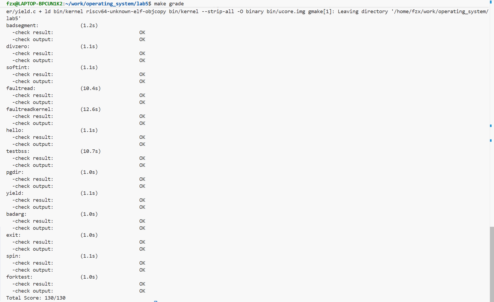
# 练习3:阅读分析源代码，理解进程执行 fork/exec/wait/exit 的实现，以及系统调用的实现（不需要编码）
## fork/exec/wait/exit 执行流程分析

### 一、FORK（创建子进程）

#### 执行流程：

```
【用户态】
1. 用户程序调用 fork()
   └─> user/libs/ulib.c:fork()
       └─> user/libs/syscall.c:sys_fork()
           └─> syscall(SYS_fork)
               └─> 内联汇编：设置 a0=SYS_fork，执行 ecall 指令
                   └─> 【触发异常：CAUSE_USER_ECALL，切换到内核态】

【内核态】
2. 异常处理入口
   └─> kern/trap/trapentry.S:__alltraps
       └─> SAVE_ALL（保存所有寄存器到 trapframe）
           └─> kern/trap/trap.c:exception_handler()
               └─> case CAUSE_USER_ECALL:
                   └─> tf->epc += 4（跳过 ecall 指令）
                       └─> kern/syscall/syscall.c:syscall()
                           └─> 从 trapframe 读取系统调用号（a0）和参数
                               └─> sys_fork(arg[])
                                   └─> kern/process/proc.c:do_fork()
                                       ├─> alloc_proc()（分配进程结构体）
                                       ├─> setup_kstack()（分配内核栈）
                                       ├─> copy_mm()（复制内存空间）
                                       │   └─> dup_mmap()（复制虚拟内存区域）
                                       │       └─> copy_range()（复制物理页内容）
                                       ├─> copy_thread()（设置 trapframe 和 context）
                                       ├─> get_pid()（分配 PID）
                                       ├─> hash_proc()（加入哈希表）
                                       ├─> set_links()（设置进程关系）
                                       └─> wakeup_proc()（唤醒子进程，设为 RUNNABLE）
                                           └─> 返回值：子进程 PID（写入 trapframe->gpr.a0）

3. 异常返回
   └─> kern/trap/trapentry.S:__trapret
       └─> RESTORE_ALL（从 trapframe 恢复所有寄存器）
           └─> sret（返回到用户态，从 sepc 继续执行）

【用户态】
4. 用户程序继续执行
   └─> syscall() 返回（a0 寄存器包含返回值）
       └─> sys_fork() 返回
           └─> fork() 返回
               └─> 父进程：返回子进程 PID
               └─> 子进程：返回 0（由 copy_thread 设置 proc->tf->gpr.a0 = 0）
```

#### 用户态 vs 内核态：

- 用户态：
  - 调用 `fork()` → `sys_fork()` → `syscall()`
  - 执行 `ecall` 触发系统调用
  - 接收返回值并判断父子进程

- 内核态：
  - 异常处理与系统调用分发
  - 创建进程结构体、分配资源
  - 复制内存空间和页表
  - 设置子进程上下文
  - 将返回值写入 trapframe

---

### 二、EXEC（执行新程序）

#### 执行流程：

```
【用户态】
1. 用户程序调用 exec(name, binary, size)
   └─> user/libs/ulib.c:exec()（如果存在）
       └─> user/libs/syscall.c:sys_exec()
           └─> syscall(SYS_exec, name, len, binary, size)
               └─> 内联汇编：设置 a0=SYS_exec, a1=name, a2=len, a3=binary, a4=size
                   └─> ecall 指令
                       └─> 【触发异常：CAUSE_USER_ECALL，切换到内核态】

【内核态】
2. 异常处理
   └─> __alltraps → exception_handler → syscall()
       └─> sys_exec(arg[])
           └─> kern/process/proc.c:do_execve()
               ├─> 参数验证（检查程序名指针有效性）
               ├─> 复制程序名到内核栈（安全处理）
               ├─> 释放旧内存空间
               │   ├─> exit_mmap()（取消虚拟内存映射）
               │   ├─> put_pgdir()（释放页目录）
               │   └─> mm_destroy()（销毁内存管理结构）
               ├─> load_icode()（加载新程序）
               │   ├─> 解析 ELF 格式
               │   ├─> 创建新的内存空间和页表
               │   ├─> 加载代码段、数据段
               │   ├─> 设置 BSS 段
               │   └─> 设置 trapframe（栈指针、程序入口点、用户模式）
               └─> set_proc_name()（更新进程名）
                   └─> 返回值：0（成功）或错误码（写入 trapframe->gpr.a0）

3. 异常返回
   └─> __trapret → RESTORE_ALL → sret
       └─> 【返回到用户态，但此时 PC 已设置为新程序的入口点】

【用户态】
4. 新程序开始执行
   └─> 从新程序的入口点（elf->e_entry）开始执行
       └─> 新程序的内存映像已完全替换旧程序
```

#### 用户态 vs 内核态：

- 用户态：
  - 调用 `exec()` → `sys_exec()` → `syscall()`
  - 执行 `ecall` 触发系统调用
  - 返回后直接进入新程序入口（不再回到原调用点）

- 内核态：
  - 异常处理与系统调用分发
  - 参数验证与安全复制
  - 释放旧内存空间
  - 加载新程序（ELF 解析、内存映射、设置 trapframe）
  - 更新进程信息

---

### 三、WAIT（等待子进程）

#### 执行流程：

```
【用户态】
1. 用户程序调用 wait() 或 waitpid(pid, store)
   └─> user/libs/ulib.c:wait() 或 waitpid()
       └─> user/libs/syscall.c:sys_wait()
           └─> syscall(SYS_wait, pid, store)
               └─> ecall 指令
                   └─> 【触发异常：CAUSE_USER_ECALL，切换到内核态】

【内核态】
2. 异常处理
   └─> __alltraps → exception_handler → syscall()
       └─> sys_wait(arg[])
           └─> kern/process/proc.c:do_wait()
               ├─> 参数验证（检查 code_store 指针有效性）
               ├─> 查找子进程
               │   ├─> 如果 pid != 0：查找指定 PID 的子进程
               │   └─> 如果 pid == 0：遍历所有子进程
               ├─> 检查子进程状态
               │   ├─> 如果找到 ZOMBIE 子进程：
               │   │   ├─> 读取退出码（写入 code_store）
               │   │   ├─> remove_links()（从进程链表移除）
               │   │   ├─> put_kstack()（释放内核栈）
               │   │   ├─> kfree()（释放进程结构体）
               │   │   └─> 返回子进程 PID
               │   └─> 如果没有 ZOMBIE 子进程：
               │       ├─> 设置 wait_state = WT_CHILD（等待子进程状态）
               │       ├─> 设置进程状态 = PROC_SLEEPING（睡眠状态）
               │       └─> schedule()（调用调度器，切换到其他进程）
               │           └─> 【当前进程被阻塞，等待子进程退出】
               │
               └─> 当子进程退出时（do_exit）：
                   └─> wakeup_proc(parent)（唤醒父进程）
                       └─> 父进程被调度器重新调度
                           └─> 继续执行 do_wait()，找到 ZOMBIE 子进程并回收

3. 异常返回
   └─> __trapret → RESTORE_ALL → sret
       └─> 【返回到用户态，wait() 返回子进程 PID】

【用户态】
4. 用户程序继续执行
   └─> wait() 返回子进程 PID（或错误码）
```

#### 用户态 vs 内核态：

- 用户态：
  - 调用 `wait()` → `sys_wait()` → `syscall()`
  - 执行 `ecall` 触发系统调用
  - 可能阻塞等待，返回后获取子进程 PID

- 内核态：
  - 异常处理与系统调用分发
  - 查找子进程
  - 回收 ZOMBIE 子进程资源
  - 若无可回收子进程，则阻塞父进程并调度

---

### 四、EXIT（进程退出）

#### 执行流程：

```
【用户态】
1. 用户程序调用 exit(error_code)
   └─> user/libs/ulib.c:exit()
       └─> user/libs/syscall.c:sys_exit()
           └─> syscall(SYS_exit, error_code)
               └─> ecall 指令
                   └─> 【触发异常：CAUSE_USER_ECALL，切换到内核态】

【内核态】
2. 异常处理
   └─> __alltraps → exception_handler → syscall()
       └─> sys_exit(arg[])
           └─> kern/process/proc.c:do_exit()
               ├─> 安全检查（不能是 idleproc 或 initproc）
               ├─> 释放内存空间
               │   ├─> exit_mmap()（取消虚拟内存映射）
               │   ├─> put_pgdir()（释放页目录）
               │   └─> mm_destroy()（销毁内存管理结构）
               ├─> 设置进程状态 = PROC_ZOMBIE
               ├─> 保存退出码
               ├─> 处理子进程（将子进程挂到 initproc 下）
               ├─> 唤醒父进程（如果父进程在等待）
               └─> schedule()（调用调度器，切换到其他进程）
                   └─> 【当前进程不再被调度，资源等待父进程回收】

3. 异常返回
   └─> 【不会返回到用户态，进程已退出】
```

#### 用户态 vs 内核态：

- 用户态：
  - 调用 `exit()` → `sys_exit()` → `syscall()`
  - 执行 `ecall` 触发系统调用
  - 不会返回（进程已退出）

- 内核态：
  - 异常处理与系统调用分发
  - 释放进程资源
  - 设置 ZOMBIE 状态
  - 处理子进程关系
  - 唤醒父进程
  - 调用调度器切换进程

---

## 关键点总结

### 1. 用户态与内核态的交错执行

```
用户态程序
    ↓ (ecall)
内核态异常处理（__alltraps）
    ↓
内核态系统调用处理（syscall → sys_* → do_*）
    ↓ (sret)
用户态程序继续执行（或新程序开始执行）
```

### 2. 内核态结果返回给用户程序

- 通过 trapframe 传递：
  - 系统调用号：`trapframe->gpr.a0`
  - 参数：`trapframe->gpr.a1` ~ `a5`
  - 返回值：写入 `trapframe->gpr.a0`
- 返回流程：
  - `syscall()` 将返回值写入 `tf->gpr.a0`
  - `__trapret` 执行 `RESTORE_ALL` 恢复寄存器
  - `sret` 返回到用户态，`a0` 包含返回值
  - 用户程序从 `syscall()` 返回，读取 `ret` 变量

### 3. 特权级切换机制

- 用户态 → 内核态：
  - `ecall` 触发 `CAUSE_USER_ECALL`
  - CPU 自动切换到内核态
  - 跳转到 `stvec`（异常向量地址）
- 内核态 → 用户态：
  - `sret` 从 `sepc` 恢复 PC
  - 从 `sstatus` 恢复特权级
  - 返回到用户态继续执行

### 4. 进程状态转换

- FORK：创建子进程，父子进程都变为 RUNNABLE
- EXEC：替换进程内存映像，进程继续运行
- WAIT：父进程可能变为 SLEEPING，等待子进程退出
- EXIT：进程变为 ZOMBIE，等待父进程回收

## ucore 用户态进程执行状态生命周期图

```
                    【进程创建】
                         |
                         V
                  ┌──────────────┐
                  │ PROC_UNINIT  │  未初始化状态
                  │              │  (进程结构体刚分配)
                  └──────────────┘
                         |
                         | alloc_proc()
                         | (分配进程结构体)
                         |
                         | proc_init() / wakeup_proc()
                         | (初始化进程 / 唤醒进程)
                         |
                         V
                  ┌──────────────┐
                  │PROC_RUNNABLE │  可运行状态
                  │              │  (可能正在运行或等待调度)
                  └──────────────┘
                         |
         ┌───────────────┼───────────────┐
         |               |               |
         |               |               |
         |               |               |
    proc_run()      schedule()      do_exit()
    (切换运行)      (调度切换)      (进程退出)
         |               |               |
         |               |               |
         |               |               |
         V               V               V
    ┌─────────┐    ┌─────────┐    ┌──────────────┐
    │ RUNNING │    │PROC_    │    │ PROC_ZOMBIE │  僵尸状态
    │         │    │RUNNABLE │    │              │  (进程已退出，
    │(实际运行)│    │(等待调度)│    │              │   等待父进程回收)
    └─────────┘    └─────────┘    └──────────────┘
         |               |               |
         |               |               |
         |               |               |
         +───────────────+               |
         |                               |
         |                               |
         |                               |
         |  do_wait() / do_sleep() /     |
         |  try_free_pages()             |
         |  (等待子进程/睡眠/等待内存)    |
         |                               |
         V                               |
    ┌──────────────┐                     |
    │PROC_SLEEPING │  睡眠状态            |
    │              │  (等待事件发生)      |
    └──────────────┘                     |
         |                               |
         | wakeup_proc()                 |
         | (被唤醒)                      |
         |                               |
         +───────────────────────────────+
         |                               |
         V                               |
    ┌──────────────┐                     |
    │PROC_RUNNABLE │                     |
    └──────────────┘                     |
         |                               |
         | do_wait() 回收 ZOMBIE 子进程   |
         | (父进程调用)                   |
         |                               |
         +───────────────────────────────+
         |                               |
         | (子进程资源被回收，从系统中删除)
         |                               |
         V
    【进程销毁】
```

## 详细状态转换说明

### 1. **PROC_UNINIT（未初始化）**
- 含义：进程结构体刚分配，尚未初始化
- 产生：`alloc_proc()`
- 转换到 PROC_RUNNABLE：
  - `proc_init()`：初始化进程
  - `wakeup_proc()`：唤醒进程（如 fork 后唤醒子进程）

### 2. **PROC_RUNNABLE（可运行）**
- 含义：可运行，可能在运行或等待调度
- 产生：
  - `proc_init()`：初始化完成
  - `wakeup_proc()`：从睡眠唤醒
  - `do_fork()`：创建子进程后唤醒
- 转换到 PROC_SLEEPING：
  - `do_wait()`：等待子进程退出（无 ZOMBIE 子进程时）
  - `do_sleep()`：主动睡眠
  - `try_free_pages()`：等待内存释放
- 转换到 PROC_ZOMBIE：
  - `do_exit()`：进程退出
- 内部转换（RUNNABLE ↔ RUNNING）：
  - `proc_run()`：切换到该进程运行
  - `schedule()`：调度器切换进程

### 3. **PROC_SLEEPING（睡眠）**
- 含义：等待事件发生，不占用 CPU
- 产生：
  - `do_wait()`：等待子进程退出
  - `do_sleep()`：主动睡眠
  - `try_free_pages()`：等待内存释放
- 转换到 PROC_RUNNABLE：
  - `wakeup_proc()`：被唤醒（如子进程退出唤醒父进程）

### 4. **PROC_ZOMBIE（僵尸）**
- 含义：进程已退出，资源未完全回收，等待父进程回收
- 产生：
  - `do_exit()`：进程退出
- 转换：无（最终状态，只能被父进程回收后销毁）
- 回收：
  - `do_wait()`：父进程回收子进程资源
  - 回收后进程从系统中删除

## 关键函数调用关系

```
进程创建流程：
alloc_proc() → proc_init() / do_fork() → wakeup_proc()
    ↓
PROC_UNINIT → PROC_RUNNABLE

进程运行流程：
schedule() → proc_run() → (用户程序执行) → schedule()
    ↓
PROC_RUNNABLE ↔ RUNNING (实际运行)

进程睡眠流程：
do_wait() / do_sleep() → current->state = PROC_SLEEPING → schedule()
    ↓
PROC_RUNNABLE → PROC_SLEEPING

进程唤醒流程：
wakeup_proc() → proc->state = PROC_RUNNABLE
    ↓
PROC_SLEEPING → PROC_RUNNABLE

进程退出流程：
do_exit() → current->state = PROC_ZOMBIE → wakeup_proc(parent) → schedule()
    ↓
PROC_RUNNABLE → PROC_ZOMBIE

进程回收流程：
do_wait() → 找到 ZOMBIE 子进程 → remove_links() → put_kstack() → kfree()
    ↓
PROC_ZOMBIE → (进程销毁)
```

## 状态转换表

| 源状态 | 目标状态 | 触发函数/事件 | 说明 |
|--------|----------|---------------|------|
| PROC_UNINIT | PROC_RUNNABLE | `proc_init()`, `wakeup_proc()` | 进程初始化或唤醒 |
| PROC_RUNNABLE | PROC_SLEEPING | `do_wait()`, `do_sleep()`, `try_free_pages()` | 等待事件发生 |
| PROC_SLEEPING | PROC_RUNNABLE | `wakeup_proc()` | 事件发生，被唤醒 |
| PROC_RUNNABLE | PROC_ZOMBIE | `do_exit()` | 进程退出 |
| PROC_RUNNABLE | RUNNING | `proc_run()` | 被调度器选中运行 |
| RUNNING | PROC_RUNNABLE | `schedule()` | 时间片用完或被抢占 |
| PROC_ZOMBIE | (销毁) | `do_wait()` | 父进程回收资源 |

# 扩展练习 Challenge:实现 Copy on Write （COW）机制
## 1. 背景
### 1.1 传统 fork 的局限性
在类Unix系统中，fork 是创建新进程的基础。传统的实现方式采用了“全量复制”策略，即在创建子进程时，完整地复制父进程的整个用户地址空间。这种策略虽然逻辑简单，但其性能瓶颈显而易见：当父进程占用大量内存时，复制操作会消耗大量的CPU时间和内存资源，导致进程创建过程缓慢。更严重的是，**在 fork 后立即调用 exec 的场景下，刚刚被完整复制的内存空间会立刻被新程序覆盖**，使得前期的复制工作完全成为无用功，造成了极大的资源浪费。
### 1.2 COW机制的核心思想
写时复制（COW）机制正是为了解决上述低效问题而诞生的一种懒惰策略。其核心思想在于**最大限度地推迟物理内存的复制操作**。当 fork 调用发生时，内核不再复制父进程的物理内存页，而是让子进程的页表直接指向父进程的物理页，并将这些共享的页面同时标记为只读。**父子进程在读取这些页面时并无差异，且开销极低**。**只有当其中任何一方尝试对共享页面进行写操作时，硬件会因权限不足而触发缺页异常**。此时，内核才会介入，为写入方复制一个新的、私有的物理页面副本，并恢复其写权限，从而保证了进程间的内存隔离。

## 2. 整体设计方案
### 2.1 核心数据结构的修改
在原有表示总映射次数的 ref 计数基础上，我们新增了一个 int cow_ref; 成员。**cow_ref 专门用于记录一个物理页被多少个页表项（PTE）以“写时复制”的模式（即只读共享）所引用**。ref 统计的是所有映射的总和，而 cow_ref 则是其中的一个**子集**，它的存在使我们能在缺页异常和内存释放时，精确判断页面是否处于COW共享状态以及共享的程度，从而做出正确的决策。

### 2.2 三大核心机制的改造
实现COW机制需要对操作系统内核的三个关键子系统进行协同改造，形成一个完整的闭环。我们的设计方案分别针对进程的创建、异常处理和内存释放三个环节进行修改。首先，在进程创建（do_fork）时，我们将内存处理逻辑**从“全量复制”切换为“共享页面并设为只读”**。其次，在缺页异常处理（do_pgfault）中，我们**增加了对COW缺页的识别与处理能力，实现真正的“按需复制”**。最后，在内存释放（do_exit）时，我们必须确保能**正确维护共享页面的引用计数**，防止因共享关系而导致的内存泄漏或悬挂指针。

### 2.3 关键函数调用关系图
当用户程序调用 fork() 时，会触发一次系统调用，其在内核中的核心执行路径如下：
sys_fork() -> do_fork() -> copy_mm() -> dup_mmap() -> copy_range_cow()
**这个调用链清晰地展示了从系统调用入口，到进程控制块复制，再到内存管理器 mm_struct 的复制，最终深入到遍历每一个虚拟内存区域（VMA）并调用我们新实现的 copy_range_cow 函数来建立共享映射的全过程**。这个流程是我们实现COW机制的“主动”环节，它为后续的“被动”缺页异常处理埋下了伏笔。

## 3. 详细实现过程
### 3.1 步骤一：fork 时的共享实现 (copy_range_cow)
为将 fork 的行为从“全量复制”转变为“共享”，我们实现了一个新的核心函数 copy_range_cow，并在 dup_mmap 中调用它。此函数的关键在于不再分配新的物理页，而是让父子进程共享物理页，并巧妙地设置页表权限和引用计数。

#### 设计思路:
copy_range_cow **遍历父进程的每一个虚拟页面**，并根据其当前状态进行分类处理。我们定义了三种情况：

- 普通可写页：这是页面首次进入COW状态。**我们将 cow_ref 初始化为2（代表父、子两个共享者）**，并原子地将父进程的PTE从可写改为只读，为后续的写时复制埋下“绊马索”。
- 已处于COW状态的页：若父进程PTE已是只读且 cow_ref 大于0，说明该页面已被其他进程共享。我们仅需**将 cow_ref 加一**，为这个共享团体引入一个新成员。
- 普通只读页（如代码段）：这类页面天生只读，不参与“写时复制”机制，我们只需增加其总引用计数 ref，无需处理 cow_ref。
- 
无论何种情况，最终都会为子进程创建一个指向共享物理页的、权限为只读的PTE。

#### 核心源码展示 (kern/mm/pmm.c):
```c
int copy_range_cow(pde_t *to, pde_t *from, uintptr_t start, uintptr_t end)
{
    assert(start % PGSIZE == 0 && end % PGSIZE == 0);
    assert(USER_ACCESS(start, end));

    do
    {
        pte_t *parent_ptep = get_pte(from, start, 0);
        if (parent_ptep == NULL || !(*parent_ptep & PTE_V)) {
            start = ROUNDDOWN(start + PTSIZE, PTSIZE);
            continue;
        }

        struct Page *page = pte2page(*parent_ptep);
        
        // 核心计数逻辑：根据页面当前状态决定如何更新 cow_ref
        if ((*parent_ptep & PTE_W) && page->cow_ref == 0) {
            // 情况1：普通可写页，首次进入COW
            page->cow_ref = 2;
            *parent_ptep &= ~PTE_W;
            tlb_invalidate(from, start);

        } else if (!(*parent_ptep & PTE_W) && page->cow_ref > 0) {
            // 情况2：页面已经处于COW状态
            page->cow_ref++;
        }
        
        // 统一为子进程创建只读映射
        pte_t *child_ptep = get_pte(to, start, 1);
        if (child_ptep == NULL) { return -E_NO_MEM; }
        uint32_t perm = *parent_ptep & PTE_USER;
        *child_ptep = pte_create(page2ppn(page), (PTE_V | perm) & ~PTE_W);

        // 统一增加物理页的总引用计数
        page_ref_inc(page);

        start += PGSIZE;
    } while (start != 0 && start < end);
    
    return 0;
}
```
### 3.2 步骤二：缺页异常中的“写时复制” (do_pgfault)
do_pgfault 函数是COW机制的“心脏”，它负责在硬件触发缺页异常时执行真正的复制操作。我们通过增强此函数，使其能够精确识别并处理COW缺页。
#### 3.2.1 设计思路:
do_pgfault 的处理流程被设计成一个多级诊断系统。首先，它通过 find_vma 确认缺页地址的合法性，并**增加了对堆区的“按需分页”支持，即当访问一个未规划但合法的堆地址时，能动态创建VMA**。其次，它检查VMA的逻辑权限，以过滤掉非法的段错误。核心部分在于，当一个写缺页发生在一个PTE有效但只读的页面上时，它会检查物理页的 cow_ref 计数：若 cow_ref 大于1，则执行“分配-复制-重映射”的标准写时复制流程；若 cow_ref 等于1，则进行优化，直接在原PTE上授予写权限，并将 cow_ref 清零，使页面回归普通状态。

#### 3.2.2 核心源码展示 (kern/mm/vmm.c):
```c
int do_pgfault(struct mm_struct *mm, uint32_t cause, uintptr_t addr) {
    
    // 步骤1: 查找该地址所属的虚拟内存区域(VMA)
    struct vma_struct *vma = find_vma(mm, addr);

    // 步骤2: 合法性检查 - 确认访问地址是否在已声明的合法VMA内
    if (vma == NULL || addr < vma->vm_start) {
        // 按需分页(Demand Paging)处理：若地址在合法堆区，则动态创建VMA
        if (addr >= UTEXT && addr < USTACKTOP) {
            if (mm_map(mm, ROUNDDOWN(addr, PGSIZE), PGSIZE, VM_READ | VM_WRITE, NULL) != 0) {
                return -1; // 创建VMA失败
            }
            vma = find_vma(mm, addr); // 重新查找VMA
        } else {
            return -1; // 非法内存访问，地址越界
        }
    }
    
    // 步骤3: 权限检查 - 确认操作类型是否符合VMA的逻辑权限
    bool is_write = (cause == CAUSE_STORE_PAGE_FAULT);
    if (is_write && !(vma->vm_flags & VM_WRITE)) {
        return -1; // 段错误(Segmentation Fault)：试图写入一个只读VMA区域
    }

    // 步骤4: 获取页表项(PTE)的指针，准备进行硬件层面的操作
    uintptr_t aligned_addr = ROUNDDOWN(addr, PGSIZE);
    pte_t *ptep = get_pte(mm->pgdir, aligned_addr, 1); // create=1, 若中间页表不存在则创建

    if (ptep == NULL) {
        return -E_NO_MEM; // 创建/获取页表项失败
    }
    
    // 步骤5: 根据PTE的状态，决定具体的处理策略
    if (!(*ptep & PTE_V)) {
        // --- 策略A: 普通缺页 (PTE无效)，需要分配物理页 ---
        uint32_t perm = PTE_U;
        if (vma->vm_flags & VM_READ) { perm |= PTE_R; }
        if (vma->vm_flags & VM_WRITE) { perm |= PTE_W; }
        if (pgdir_alloc_page(mm->pgdir, aligned_addr, perm) == NULL) {
            return -E_NO_MEM; // 分配物理页或建立映射失败
        }
    } else {
        // --- 策略B: PTE有效，检查是否为COW缺页 ---
        // COW缺页的特征：写操作 && PTE有效但只读
        if (!(*ptep & PTE_W) && is_write) {
            struct Page *page = pte2page(*ptep);
            // 确保这是一个真正的COW页面
            if (page->cow_ref > 0) {
                if (page->cow_ref > 1) {
                    // -- COW情况1: 页面被多人共享，必须复制 --
                    struct Page *npage;
                    if ((npage = alloc_page()) == NULL) { return -E_NO_MEM; }
                    
                    memcpy(page2kva(npage), page2kva(page), PGSIZE);
                    // 将当前进程的PTE重映射到新页，并授予写权限
                    page_insert(mm->pgdir, npage, aligned_addr, (*ptep & PTE_USER) | PTE_W);
                } else { // cow_ref <= 1
                    // -- COW情况2: 我是最后一个使用者，直接获取写权限 --
                    *ptep |= PTE_W; // 在原PTE上添加写权限
                    tlb_invalidate(mm->pgdir, aligned_addr);
                    page->cow_ref = 0; // 清除COW标记
                }
            }
        }
        // 如果不是COW缺页 (PTE可写或为读操作)，则无需任何操作
    }
    
    return 0; // 缺页处理成功
}
```   
#### 3.2.3 设计说明：基于VMA的按需分页与动态堆区管理
在我们实现的 do_pgfault 函数中，一个核心设计是它不仅能处理已存在映射的缺页（如COW缺页），还能处理访问尚未建立任何映射的地址所引发的缺页。这种机制通常被称为“按需分页”（Demand Paging），是我们为了支持像 malloc 或直接地址访问这样的堆内存操作而专门引入的。以下代码块展示了这一逻辑：
```c
// do_pgfault 函数中的动态VMA创建逻辑
if (vma == NULL || addr < vma->vm_start) {
    // 按需分页(Demand Paging)处理：若地址在合法堆区范围内，则为其动态创建VMA
    if (addr >= UTEXT && addr < USTACKTOP) {
        if (mm_map(mm, ROUNDDOWN(addr, PGSIZE), PGSIZE, VM_READ | VM_WRITE, NULL) != 0) {
            return -1; // 创建VMA失败
        }
        vma = find_vma(mm, addr); // 重新查找VMA
    } else {
        return -1; // 非法内存访问，地址越界
    }
}
```
- **VMA的初始布局与动态扩展**
    ```
     4G ------------------> +---------------------------------+
                            |         内核空间 (Kernel)        |  <-- 用户不可访问
     KERNBASE ------------> +---------------------------------+ 0xC0000000 (3GB)
                            |        (隔离带)                  |
     USTACKTOP -----------> +---------------------------------+ 0x80000000 (2GB)
                            |           用户栈 (Stack)         |  <-- 向下增长
                            +---------------------------------+
                            |                                 |
                            |                                 |
                            |           堆 (Heap)             |  <-- 向上增长
                            |                                 |
                            |                                 |
                            +---------------------------------+
                            |.bss, .data (已初始化/未初始化数据)|
                            +---------------------------------+
                            |         .text (代码段)          |
     UTEXT ---------------> +---------------------------------+ 0x00800000 (8MB)
                            |        (隔离带)                 |
     0 -------------------> +---------------------------------+ 0x00000000
    ```
    为了理解上述代码的必要性，我们首先需要考察一个用户进程在启动之初的虚拟内存布局。**通过在load_icode函数中加入打印，我们观察到 cow_test 程序在执行第一条指令前，其内存管理器mm_struct中仅包含由ELF文件信息确定的几个核心VMA**：
    ```
    --- load_icode: VMA 分配情况 ---
    VMA: 0x00800000 - 0x00801000, flags: r-x
    VMA: 0x00801000 - 0x00802000, flags: rw-
    VMA: 0x7ff00000 - 0x80000000, flags: rw-
    ----------------------------------
    代码段 (.text): VMA: 0x00800000 - 0x00801000, 4KB, flags: r-x。这块区域从 UTEXT 地址开始，存放程序的机器指令，权限为只读、可执行。

    数据段 (.data): VMA: 0x00801000 - 0x00802000, 4KB, flags: rw-。紧随代码段之后，这块区域用于存放已初始化的全局变量（如我们新加入的 some_global_variable），权限为可读写。

    栈 (Stack): VMA: 0x7ff00000 - 0x80000000, 1MB, flags: rw-。位于用户空间顶部，为函数调用栈预留了广阔的虚拟地址空间，权限为可读写。
    ```

    从这份初始“规划图”中我们发现，**介于数据段末尾（约0x802000）和栈底（0x7ff00000）之间的广阔堆区，在初始状态下是未被规划的，即不存在任何VMA**。
- **按需创建VMA：对缺页的响应**
在我们的 cow_test 程序中，*shared_mem = 12345; 这行代码试图写入地址 0x10000000。由于该地址在初始VMA布局中是一片空白，硬件MMU无法找到对应的页表项，因而触发了“存储页错误”。此时，do_pgfault 函数介入：
    ```
    存储 / AMO 页错误
    <<<<<<<<<<<<<<<<<<<<<<<<<<<<<<
    KERNEL:捕获到缺页异常！(PID=2)
    - 缺页地址: 0x10000000
    - 诊断: 地址不在任何已知的VMA内。
    - 决策: 按需分配(Demand Paging)，为堆区地址创建新VMA。
    - 成功: 新的VMA已创建。
    - 诊断: 访问地址位于VMA [0x10000000, 0x10001000)。
    - ...
    - 诊断: PTE无效。这是一个普通缺页，需要分配新的物理页。
    - 修复: 成功分配新物理页并建立映射。
    >>>>>>>>>>>>>>>>>>>>>>>>>>>>>>
    ```
    - do_pgfault 首先调用 find_vma，返回NULL，日志打印“地址不在任何已知的VMA内”。

    - **程序进入我们的关键判断逻辑 if (addr >= UTEXT && addr < USTACKTOP)。0x10000000 位于这个合法的用户堆区范围内，判断成功**。

    - 内核立即决策，**调用 mm_map 为 0x10000000 所在的4KB页面动态创建了一个新的VMA**，范围为 [0x10000000, 0x10001000)，权限为可读写。

    - 随后，do_pgfault 发现VMA已存在，但PTE尚不存在（无效），于是继续执行普通缺页流程，为该地址分配一个物理页并建立映射。


### 3.3 步骤三：进程退出时的引用计数维护
#### 设计思路:
在解除一个页表映射时，我们增加一个判断逻辑。如果被解除的PTE是只读的，并且它指向的物理页的 cow_ref 大于0，我们就判定这是一个COW共享链接的断开，并相应地将 cow_ref 减一。无论如何，物理页的总引用计数 ref 都会被递减。只有当 ref 降为0时，才说明该物理页已没有任何使用者，可以被安全地释放回系统。
#### 核心源码展示 (kern/mm/pmm.c):
```c
static inline void page_remove_pte(pde_t *pgdir, uintptr_t la, pte_t *ptep)
{
    if (*ptep & PTE_V)
    {
        struct Page *page = pte2page(*ptep);

        // 新增COW处理逻辑
        if (!(*ptep & PTE_W) && page->cow_ref > 0) {
            page->cow_ref--;
        }

        // 总引用计数-1，并在为0时释放页面
        if (page_ref_dec(page) == 0)
        {
            assert(page->cow_ref == 0);
            free_page(page);
        }
        
        *ptep = 0;
        tlb_invalidate(pgdir, la);
    }
}
```


## 4. COW状态转换模型（有限状态自动机）
为了清晰地描述一个物理页面在写时复制（COW）机制下的生命周期，我们可以将其抽象为一个简单的有限状态自动机（Finite State Automaton, FSA）。该模型的核心是物理页面的状态及其在不同内核事件驱动下的转换关系，其中，页面的总引用计数 ref 和COW引用计数 cow_ref 是状态描述的关键变量。
### 4.1 物理页面的COW相关状态定义
我们定义一个物理页面与COW机制相关的三种核心状态：
- 普通可写 (Writable): 页面未被共享或仅被一个进程以可写方式映射。在此状态下，cow_ref 必须为0。
- COW共享 (COW-Shared): 页面被两个或多个进程以只读方式共享。在此状态下，cow_ref 必须大于1。
- COW独占 (COW-Exclusive): 页面曾被共享，但现在只剩下一个进程在使用它（仍为只读映射）。这是从“COW共享”到“普通可写”的中间状态。在此状态下，cow_ref 必须等于1。
### 4.2 状态转换图与说明
```
┌─────────────────────────┐
│      普通可写页面        │
│     Normal_RW           │
│   ref=1, cow_ref=0      │
└──────────┬──────────────┘
           │ 事件1：fork()
           │ (copy_range_cow)
           ▼
┌─────────────────────────┐
│     COW 共享页面         │
│     COW_Shared          │◄─────────────--┐
│   ref>1, cow_ref>1      │                | 
└─────——────────┬─────────┘                |
      ▲         │                          |    
      │         │                          |
      │         │                          |
事件2：fork()   │ 事件3：写操作（写时复制）  |
（再次 fork）   │                          |
      │         ▼                          |
      │   ┌─────────────────────────┐      | 
      │   │      新分配页面          │      |  
      │   │      Normal_RW          │      |
      │   │   ref=1, cow_ref=0      │      |
      │   └─────────────────────────┘      |
      │                                    |  
      │   原页面 ref--, cow_ref--          |
      │                                    |
                                           |
┌─────────────────────────┐                |
│     COW 独占页面         │◄────────────-─┐
│     COW_Exclusive        │               │
│   ref>0, cow_ref=1       │               │
└─────┬─────────┬─────────┘                │
      │         │                          │
      │         │                          │
事件4：写操作   │ 事件5：exit()             │
（唯一拥有者写）│（共享者减少）              │   
      │         │                          │
      ▼         └────────────────────────-─┘
┌─────────────────────────┐                 
│      普通可写页面        │                 
│     Normal_RW           │                 
│   ref=1, cow_ref=0      │                 
└──────────┬──────────────┘                 
           │                                       
   最后一个进程 exit                        
           ▼                                
┌─────────────────────────┐                 
│        页面释放          │             
│        Freed            │             
│   ref=0, cow_ref=0      │              
└─────────────────────────┘             


```
状态转换事件详解:
- 事件1: fork() 一个 Normal_RW 页面
    - 触发: 父进程 fork，内核执行 copy_range_cow 处理一个普通可写页。
    - 转换: Normal_RW -> COW_Shared。
    - 计数变化: **ref 从1变为2 (父+子)，cow_ref 从0变为2**。
    - 说明: 页面首次进入COW状态，父子PTE均被设为只读。
  
- 事件2: fork() 一个已 COW 的页面
    - 触发: 一个已经处于COW状态的进程再次 fork。
    - 转换: COW_Exclusive -> COW_Shared 或 COW_Shared -> COW_Shared。
    - 计数变化: ref 加1，cow_ref 加1。
    - 说明: 共享团体增加一个新成员。
- 事件3: 在 COW_Shared 页面上发生写操作
    - 触发: 某个共享进程尝试写入，do_pgfault 被调用。
    - 转换:
        - 对原物理页: 状态保持 COW_Shared (如果共享者还>1) 或变为 COW_Exclusive (如果共享者只剩1)。
        - 对新创建的页面: 状态为 Normal_RW。
    - 计数变化: 原物理页的 ref 减1，cow_ref 减1；新物理页的 ref=1, cow_ref=0。
    - 说明: 触发了“写时复制”，写入方获得了页面的私有可写副本。
- 事件4: 在 COW_Exclusive 页面上发生写操作
    - 触发: 页面的唯一使用者尝试写入，do_pgfault 被调用。
    - 转换: COW_Exclusive -> Normal_RW。
    - 计数变化: ref 不变，cow_ref 从1变为0。
    - 说明: **内核进行优化，直接在原页面上授予写权限，页面回归普通状态**。
- 事件5: 进程 exit()，解除对COW页面的映射
    - 触发: 进程退出，内核执行 page_remove_pte。
    - 转换: COW_Shared -> COW_Shared 或 COW_Shared -> COW_Exclusive。
    - 计数变化: ref 减1，cow_ref 减1。
    - 说明: 共享团体减少一个成员。
- 事件6: 进程 exit()，解除对 Normal_RW 或最后一块COW页的映射
    - 触发: 页面的最后一个使用者退出。
    - 转换: Normal_RW / COW_Exclusive -> Freed (被释放)。
    - 计数变化: ref 减为0，cow_ref 减为0。
    - 说明: 页面被回收至物理内存管理器。

## 5. 测试与验证
为了全面验证我们实现的COW机制的正确性，我们设计并编写了一个专门的用户测试程序 cow_test.c。该程序通过模拟父子进程对共享内存的读写操作，来检验COW机制的核心功能点是否按预期工作。 
### 5.1 测试用例设计 (cow_test.c)
#### 设计目的:
本测试用例的核心目的是验证 fork 后的父子进程在内存行为上的隔离性与共享性。具体来说，它旨在检验以下几点：
- 共享读取: 子进程在 fork 后，能够正确读取到父进程在 fork 前写入内存的值。
- 写入隔离: 当子进程对共享内存进行写操作时，该修改不应影响到父进程的内存空间。
- COW触发: 子进程的写操作应能正确触发缺页异常，并由内核的“写时复制”逻辑进行处理。
- 父子同步: 父进程应能等待子进程执行完毕后再进行验证，以保证测试时序的正确性。
#### 测试程序源码:
```c
// user/cow_test.c

#include <stdio.h>
#include <ulib.h>
#include <unistd.h>
int some_global_variable = 42;
int main(void) {
    // 1. 分配一块内存，并写入初始值
    int *shared_mem = (int *)0x10000000; // 选择一个用户空间的地址
    *shared_mem = 12345;
    cprintf("父进程：原始值 = %d\n", *shared_mem);

    some_global_variable=7;

    int pid = fork();

    if (pid == 0) {
        // --- 子进程 ---
        cprintf("子进程：读取共享值 = %d\n", *shared_mem);
        
        // 子进程尝试写入
        cprintf("子进程：正在写入新值 54321...\n");
        *shared_mem = 54321;
        
        cprintf("子进程：我的新值 = %d\n", *shared_mem);
        exit(0);
        
    } else if (pid > 0) {
        // --- 父进程 ---
        // 等待子进程执行完毕
        waitpid(pid, NULL);
        
        cprintf("父进程：子进程退出后，我的值仍然是 = %d\n", *shared_mem);
        
        if (*shared_mem == 12345) {
            cprintf("COW 测试通过！\n");
        } else {
            cprintf("COW 测试失败！\n");
        }

    } else {
        cprintf("fork 失败。\n");
    }

    return 0;
}

```

### 5.2 预期结果与实际结果分析
#### 预期行为:
程序运行时，父进程首先写入 12345。fork 后，子进程应能读取到 12345。随后子进程写入 54321，此操作不应影响父进程。因此，在子进程退出后，父进程再次读取该地址时，值应仍然是 12345，最终程序打印“COW 测试通过！”。

#### 实际运行日志分析:
我们通过 make run-nox-cow_test 命令执行了测试，并获得了详细的内核日志。以下是日志的关键片段及其分析。
- **父进程初始化内存:**
  ```
    存储 / AMO 页错误
    <<<<<<<<<<<<<<<<<<<<<<<<<<<<<<
    KERNEL:捕获到缺页异常！(PID=2) ... 缺页地址: 0x10000000
    - 诊断: 地址不在任何已知的VMA内。
    - 决策: 按需分配(Demand Paging)，为堆区地址创建新VMA。
    - 诊断: PTE无效。这是一个普通缺页，需要分配新的物理页。
    - 修复: 成功分配新物理页并建立映射。
    >>>>>>>>>>>>>>>>>>>>>>>>>>>>>>
    父进程：原始值 = 12345
    ```
    **分析 :** 日志清晰地显示，父进程（PID=2）首次写入 0x10000000 时，内核通过 do_pgfault 成功为其动态创建了VMA并分配了物理页。

- **fork 创建子进程:**
  ```
    =============== fork() in kernel ===============
    KERNEL: 父进程(PID=2, name="cow_test")开始创建子进程...
    COW_fork: VA 0x10000000 首次进入COW, PPN=0x80508, cow_ref=2
    KERNEL: 子进程(PID=3)创建成功并进入就绪队列。
    ==============================================
    ```
    **分析 :** fork 被调用。我们的 copy_range_cow 探针明确指出，对于 0x10000000 这个可写页，内核没有进行物理复制，而是将其 cow_ref 设为2，进入了COW共享状态。
- **子进程写入触发COW:**
  ```
    子进程：读取共享值 = 12345
    子进程：正在写入新值 54321...
    存储 / AMO 页错误
    <<<<<<<<<<<<<<<<<<<<<<<<<<<<<<
    KERNEL:捕获到缺页异常！(PID=3) ... 缺页地址: 0x10000000
    - 诊断: 确认为COW缺页！
        - 共享物理页的 cow_ref = 2
        - 决策: 执行“写时复制”。
        - 修复: 页面已复制。旧页的共享链接已解除。
    >>>>>>>>>>>>>>>>>>>>>>>>>>>>>>
    子进程：我的新值 = 54321
    ```
    **分析 :** 子进程（PID=3）首先成功读取了共享值。当它尝试写入时，COW机制被正确触发。do_pgfault 检查到 cow_ref 为2，果断执行了“写时复制”逻辑：为子进程分配了一个新的私有页面，并将内容复制过去。子进程随后在新页面上成功写入了 54321。


- **父进程验证结果:**
  ```
    ... (父进程从 waitpid 唤醒) ...
    父进程：子进程退出后，我的值仍然是 = 12345
    COW 测试通过！
    ```
    **分析 :** 在子进程退出后，父进程被唤醒。它读取自己 0x10000000 地址处的值，该地址仍然映射到原始的、未被修改的物理页。读取到的值依然是 12345，与预期完全一致，测试通过。

**结论:**
通过对详细执行日志的分析，我们确认所实现的COW机制在进程创建、共享读取、写时复制和内存隔离等所有关键环节均表现正确，完全达到了实验设计目标。
## 6. Dirty COW 漏洞分析
### 6.1 漏洞原理与在ucore中模拟的复杂性
Dirty COW (CVE-2016-5195) 是Linux内核中一个著名的权限提升漏洞。其本质是一个竞态条件（Race Condition）：当一个线程因写入私有的只读内存映射（如通过 mmap 映射的文件）而触发写时复制（COW）时，另一个线程在同一时间通过 madvise(MADV_DONTNEED) 系统调用请求内核丢弃该内存页。**在极小的时间窗口内，这种并发操作会导致内核的缺页处理逻辑产生混淆，错误地跳过了创建页面副本的步骤，直接在原始的、本应只读的物理页面（文件缓存页）上进行了写入**。这使得低权限用户能够非法修改只读文件，从而实现权限提升。

在当前的ucore实验框架下，复现较为困难。主要原因在于ucore是一个单核、非抢占式的内核，它缺乏触发该竞态条件的必要环境。当一个进程因缺页陷入内核执行do_pgfault时，在它处理完毕并返回之前，没有其他用户线程或进程能够并发运行并调用如madvise等其他系统调用来形成竞争。此外，ucore也尚未实现mmap文件映射和madvise等复现该漏洞所必需的复杂系统调用。因此，我们仅在此进行理论层面的分析与思考。
### 6.2 ucore实现的安全性分析与改进思考
我们所实现的do_pgfault函数，在当前的ucore环境下是安全的，**因为其执行过程是原子的，不会被其他用户进程中断**。然而，若要将ucore演进为一个支持多核或内核抢占的现代操作系统，我们当前的代码实现将立刻面临类似Dirty COW的安全风险。

为了在并发环境中确保COW机制的安全性，必须引入同步与互斥机制。一个直接的解决方案是在进入do_pgfault时，获取对当前进程内存管理结构mm_struct的锁（例如，通过一个lock_mm()操作）。**这将确保在对一个进程的页表进行检查和修改的整个过程中，其他核心或线程无法同时对同一内存区域执行madvise或unmap等可能导致状态不一致的操作，从而有效阻止竞态条件的发生**。
## 7. 遇到的问题与解决方案
- VMA与按需分页的缺失: 最初，**测试程序直接访问硬编码地址导致“非法地址”错误**。通过分析，我们定位到问题在于**内核尚未为该地址建立合法的虚拟内存区域**（VMA）。解决方案是在do_pgfault中增加了对用户堆区的动态VMA创建逻辑，**实现了“按需分页”**的雏形。
- 权限标志的混淆: 在处理普通缺页时，我们曾错误地将VMA的逻辑权限标志 (VM_WRITE) 直接用于设置PTE的硬件权限，导致了无限缺页循环。通过仔细比对load_icode的实现，我们修正了代码，手动将VMA标志转换为正确的PTE硬件权限标志 (PTE_W)，解决了该问题。
- cow_ref 计数错误: 测试初期，我们发现COW页面总是在第一次写入时就被错误地直接授权，导致测试失败。通过添加详细的日志探针，我们定位到 cow_ref 计数逻辑不完备，**未能正确初始化和区分不同页面状态**。最终，我们设计并实现了能够处理**普通可写页、普通只读页和已COW页**的完备计数逻辑，彻底修复了该核心bug。

## 8. 说明该用户程序是何时被预先加载到内存中的？与我们常用操作系统的加载有何区别，原因是什么？
用户程序是在**内核编译链接阶段**被加载的。具体来说，Makefile 将所有用户程序（如 cow_test.c）编译成独立的二进制文件，然后链接器(ld)将这些二进制文件作为原始数据，**静态地嵌入**到最终生成的内核镜像文件 ucore.img 之中。因此，当操作系统内核被加载到内存时，所有的用户程序作为内核镜像的一部分，就已经“预先加载”到内存里了。

**与我们常用操作系统的加载有何区别？原因是什么？**

**区别**：

- **常用操作系统（如Linux）采用动态加载**。程序是以独立文件的形式存储在硬盘（文件系统）上的。当用户执行程序时，内核在**运行时**才去读取文件，解析其格式，并将其内容加载到进程的内存空间。程序与内核是分离的。
- **本实验的ucore**采用**静态嵌入**。程序在**编译时**就成为了内核的一部分。内核在运行时，直接从自己内存中的一个已知地址（由链接器生成的符号指定）获取程序数据，**无需访问文件系统**。

**原因**：

最主要的原因是**为了简化实验**。实现一个完整的文件系统极其复杂，通常是后续实验的重点。通过将用户程序静态嵌入内核，我们可以**绕过文件系统**这一复杂环节，从而让实验能够专注于当前的核心主题：**用户进程的创建、内存空间管理（execve的实现）和系统调用机制**。


## 9. 附：完整调试日志
```
OpenSBI v0.4 (Jul  2 2019 11:53:53)
   ____                    _____ ____ _____
  / __ \                  / ____|  _ \_   _|
 | |  | |_ __   ___ _ __ | (___ | |_) || |
 | |  | | '_ \ / _ \ '_ \ \___ \|  _ < | |
 | |__| | |_) |  __/ | | |____) | |_) || |_
  \____/| .__/ \___|_| |_|_____/|____/_____|
        | |
        |_|

Platform Name          : QEMU Virt Machine
Platform HART Features : RV64ACDFIMSU
Platform Max HARTs     : 8
Current Hart           : 0
Firmware Base          : 0x80000000
Firmware Size          : 112 KB
Runtime SBI Version    : 0.1

PMP0: 0x0000000080000000-0x000000008001ffff (A)
PMP1: 0x0000000000000000-0xffffffffffffffff (A,R,W,X)
DTB Init
HartID: 0
DTB Address: 0x82200000
Physical Memory from DTB:
  Base: 0x0000000080000000
  Size: 0x0000000008000000 (128 MB)
  End:  0x0000000087ffffff
DTB init completed
(THU.CST) os is loading ...

Special kernel symbols:
  entry  0xc020004a (virtual)
  etext  0xc0206044 (virtual)
  edata  0xc02b24b8 (virtual)
  end    0xc02b6964 (virtual)
Kernel executable memory footprint: 731KB
memory management: default_pmm_manager
physcial memory map:
  memory: 0x08000000, [0x80000000, 0x87ffffff].
vapaofset is 18446744070488326144
check_alloc_page() succeeded!
check_pgdir() succeeded!
check_boot_pgdir() succeeded!
use SLOB allocator
kmalloc_init() succeeded!
check_vma_struct() 成功！
check_vmm() 成功。

=============== fork() in kernel ===============
 KERNEL: 父进程(PID=0, name="idle")开始创建子进程...
 KERNEL: 子进程(PID=1)创建成功并进入就绪队列。
 KERNEL: fork() 即将返回: 父进程将收到 1, 子进程将收到 0。
==============================================

++ setup timer interrupts

=============== fork() in kernel ===============
 KERNEL: 父进程(PID=1, name="init")开始创建子进程...
 KERNEL: 子进程(PID=2)创建成功并进入就绪队列。
 KERNEL: fork() 即将返回: 父进程将收到 2, 子进程将收到 0。
==============================================


---------------- wait() in kernel ----------------
 KERNEL: 父进程(PID=1)调用wait()，但尚无僵尸子进程可回收。
 KERNEL: 父进程(PID=1)进入睡眠状态，等待子进程退出...
------------------------------------------------

kernel_execve: pid = 2, name = "cow_test".

[ KERNEL_EXECVE: 内核线程(PID=2)发起特殊的 execve 系统调用... ]
断点异常

++++++++++++++++ execve() in kernel ++++++++++++++++
 KERNEL: 进程(PID=2, name="")请求变身...
 KERNEL: 目标程序为: "cow_test"
 KERNEL: -> 步骤2: 调用 load_icode() 加载新程序...
--- load_icode: VMA 分配情况 ---
  VMA: 0x00800000 - 0x00801000, flags: r-x
  VMA: 0x7ff00000 - 0x80000000, flags: rw-
----------------------------------
 KERNEL: -> 步骤2: load_icode() 成功。
 KERNEL: 变身成功！新进程名为: "cow_test"
++++++++++++++++++++++++++++++++++++++++++++++++++

存储 / AMO 页错误

<<<<<<<<<<<<<<<<<<<<<<<<<<<<<<
 KERNEL:捕获到缺页异常！(PID=2)
  - 缺页地址: 0x10000000
  - 缺页类型: 写操作缺页
  - 诊断: 地址不在任何已知的VMA内。
  - 决策: 按需分配(Demand Paging)，为堆区地址创建新VMA。
  - 诊断: 访问地址位于VMA [0x10000000, 0x10001000)。
  - 诊断: VMA逻辑权限检查通过。
  - 诊断: PTE无效。这是一个普通缺页，需要分配新的物理页。
  - 修复: 成功分配新物理页并建立映射。
 KERNEL:缺页异常处理完毕。
>>>>>>>>>>>>>>>>>>>>>>>>>>>>>>

父进程：原始值 = 12345

=============== fork() in kernel ===============
 KERNEL: 父进程(PID=2, name="cow_test")开始创建子进程...
COW_fork: VA 0x10000000 首次进入COW, PPN=0x80508, cow_ref=2
 KERNEL: 子进程(PID=3)创建成功并进入就绪队列。
 KERNEL: fork() 即将返回: 父进程将收到 3, 子进程将收到 0。
==============================================


---------------- wait() in kernel ----------------
 KERNEL: 父进程(PID=2)调用wait()，但尚无僵尸子进程可回收。
 KERNEL: 父进程(PID=2)进入睡眠状态，等待子进程退出...
------------------------------------------------

存储 / AMO 页错误

<<<<<<<<<<<<<<<<<<<<<<<<<<<<<<
 KERNEL:捕获到缺页异常！(PID=3)
  - 缺页地址: 0x7fffff5c
  - 缺页类型: 写操作缺页
  - 诊断: 访问地址位于VMA [0x7ff00000, 0x80000000)。
  - 诊断: VMA逻辑权限检查通过。
  - 诊断: PTE无效。这是一个普通缺页，需要分配新的物理页。
  - 修复: 成功分配新物理页并建立映射。
 KERNEL:缺页异常处理完毕。
>>>>>>>>>>>>>>>>>>>>>>>>>>>>>>

子进程：读取共享值 = 12345
子进程：正在写入新值 54321...
存储 / AMO 页错误

<<<<<<<<<<<<<<<<<<<<<<<<<<<<<<
 KERNEL:捕获到缺页异常！(PID=3)
  - 缺页地址: 0x10000000
  - 缺页类型: 写操作缺页
  - 诊断: 访问地址位于VMA [0x10000000, 0x10001000)。
  - 诊断: VMA逻辑权限检查通过。
  - 诊断: PTE有效 (PTE=0x20142053)。检查是否为COW缺页。
  - 诊断: 确认为COW缺页！
    - 共享物理页的 cow_ref = 2
    - 决策: 执行“写时复制”。
COW_exit: 解除对 VA 0x10000000 的只读映射, cow_ref 从 2 减为 1
    - 修复: 页面已复制。旧页的共享链接已解除。
 KERNEL:缺页异常处理完毕。
>>>>>>>>>>>>>>>>>>>>>>>>>>>>>>

子进程：我的新值 = 54321

~~~~~~~~~~~~~~~ exit() in kernel ~~~~~~~~~~~~~~~
 KERNEL: 进程(PID=3, name="")开始退出，退出码=0。
 KERNEL: -> 步骤1: 释放用户内存空间...
 KERNEL: -> 步骤2: 状态已设置为“僵尸”(ZOMBIE)。
 KERNEL: -> 步骤3: 处理后事...
   - 通知父进程(PID=2)...
     (父进程已被唤醒)
   - 将所有子进程过继给 initproc(PID=1)...
 KERNEL: -> 步骤4: 永久放弃CPU，等待父进程回收。
~~~~~~~~~~~~~~~~~~~~~~~~~~~~~~~~~~~~~~~~~~~~~~~


---------------- wait() in kernel ----------------
 KERNEL: 父进程(PID=2)已被唤醒，重新查找僵尸子进程...
------------------------------------------------


---------------- wait() in kernel ----------------
 KERNEL: 父进程(PID=2)发现僵尸子进程(PID=3)。
 KERNEL: -> 正在回收子进程(PID=3)的内核栈和进程控制块...
 KERNEL: -> 子进程(PID=3)已被彻底清除。
------------------------------------------------

父进程：子进程退出后，我的值仍然是 = 12345
COW 测试通过！

~~~~~~~~~~~~~~~ exit() in kernel ~~~~~~~~~~~~~~~
 KERNEL: 进程(PID=2, name="cow_test")开始退出，退出码=0。
 KERNEL: -> 步骤1: 释放用户内存空间...
COW_exit: 解除对 VA 0x10000000 的只读映射, cow_ref 从 1 减为 0
 KERNEL: -> 步骤2: 状态已设置为“僵尸”(ZOMBIE)。
 KERNEL: -> 步骤3: 处理后事...
   - 通知父进程(PID=1)...
     (父进程已被唤醒)
   - 将所有子进程过继给 initproc(PID=1)...
 KERNEL: -> 步骤4: 永久放弃CPU，等待父进程回收。
~~~~~~~~~~~~~~~~~~~~~~~~~~~~~~~~~~~~~~~~~~~~~~~


---------------- wait() in kernel ----------------
 KERNEL: 父进程(PID=1)已被唤醒，重新查找僵尸子进程...
------------------------------------------------


---------------- wait() in kernel ----------------
 KERNEL: 父进程(PID=1)发现僵尸子进程(PID=2)。
 KERNEL: -> 正在回收子进程(PID=2)的内核栈和进程控制块...
 KERNEL: -> 子进程(PID=2)已被彻底清除。
------------------------------------------------

all user-mode processes have quit.
init check memory pass.

~~~~~~~~~~~~~~~ exit() in kernel ~~~~~~~~~~~~~~~
 KERNEL: 进程(PID=1, name="init")开始退出，退出码=0。
kernel panic at kern/process/proc.c:566:
    initproc exit.
```


# gdb 调试页表查询过程

## 1.关键的调用路径及分支语句
### 1.1关键的调用路径
通过后续的调试分析，可得知地址翻译调试过程中的关键调用路径及相关源码，我们首先在此处做一个总括的介绍，关键的调用路径如下图所示。

### 1.2 关键的分支语句
通过后续调试，笔者认为比较关键的两个分支语句如下两段代码所示
```c
//这部分分支语句位于qemu-4.1.1/accel/tcg/cputlb.c的store_helper函数中
    //如果TLB条目不匹配当前地址（TLB未命中），需要重新加载TLB 
    if (!tlb_hit(tlb_addr, addr)) {
        /* 首先检查victim TLB（辅助TLB缓存）是否命中
         victim TLB用于缓存最近被替换的TLB条目，提高命中率 */
        if (!victim_tlb_hit(env, mmu_idx, index, tlb_off,
            addr & TARGET_PAGE_MASK)) {
            // victim TLB也未命中，需要进行完整的TLB填充
            tlb_fill(env_cpu(env), addr, size, MMU_DATA_STORE,
                     mmu_idx, retaddr);
            // TLB填充后，TLB表可能被调整大小，需要重新计算索引和获取条目 
            index = tlb_index(env, mmu_idx, addr);
            entry = tlb_entry(env, mmu_idx, addr);
        }
        // 更新TLB地址标记，清除无效标志位 
        tlb_addr = tlb_addr_write(entry) & ~TLB_INVALID_MASK;
    }
```
```c
    //这部分分支语句位于qemu-4.1.1/target/riscv/cpu_helper.c的get_physical_address函数中
        //根据虚拟内存模式设置页表参数
        switch (vm) {
        case VM_1_10_SV32:
          // Sv32: 32位虚拟地址，2级页表，10位索引，4字节PTE
          levels = 2; ptidxbits = 10; ptesize = 4; break;
        case VM_1_10_SV39:
          // Sv39: 39位虚拟地址，3级页表，9位索引，8字节PTE
          levels = 3; ptidxbits = 9; ptesize = 8; break;
        case VM_1_10_SV48:
          // Sv48: 48位虚拟地址，4级页表，9位索引，8字节PTE
          levels = 4; ptidxbits = 9; ptesize = 8; break;
        case VM_1_10_SV57:
          // Sv57: 57位虚拟地址，5级页表，9位索引，8字节PTE
          levels = 5; ptidxbits = 9; ptesize = 8; break;
        case VM_1_10_MBARE:
            // MBARE模式：无虚拟地址空间，直接映射
            *physical = addr;
            *prot = PAGE_READ | PAGE_WRITE | PAGE_EXEC;
            return TRANSLATE_SUCCESS;
        default:
          g_assert_not_reached();
        }
```
在地址翻译阶段比较关键的两个函数为函数store_helper和函数get_physical_address（对该函数的解释可见3.2.1 get_physical_address函数解释部分），函数store_helper解释如下：
```c
static inline void __attribute__((always_inline))
store_helper(CPUArchState *env, target_ulong addr, uint64_t val,
             TCGMemOpIdx oi, uintptr_t retaddr, size_t size, bool big_endian)
{
    /* 根据操作索引获取当前CPU的MMU索引，用于选择对应的TLB表 */
    uintptr_t mmu_idx = get_mmuidx(oi);
    /* 计算TLB索引：根据虚拟地址和MMU索引计算TLB表数组的索引
     公式：(addr >> TARGET_PAGE_BITS) & size_mask */
    uintptr_t index = tlb_index(env, mmu_idx, addr);
    /* 获取TLB条目指针,根据索引从TLB表中获取对应的条目 */
    CPUTLBEntry *entry = tlb_entry(env, mmu_idx, addr);
    /* 获取TLB条目的写地址标记：从TLB条目中提取用于写操作的地址标记(包含虚拟地址的页号部分、标志位等)*/
    target_ulong tlb_addr = tlb_addr_write(entry);
    /* 用于victim TLB查找，记录addr_write字段在结构体CPUTLBEntry中的偏移 */
    const size_t tlb_off = offsetof(CPUTLBEntry, addr_write);
    // 获取对齐位数：根据内存操作类型获取要求的对齐位数
    unsigned a_bits = get_alignment_bits(get_memop(oi));
    
    //haddr 是主机地址，是 QEMU 进程中的实际内存地址，用于写入数据。
    void *haddr;
    //如果地址不符合对齐要求（addr的低a_bits位不为0）， 则触发未对齐访问异常处理 
    if (addr & ((1 << a_bits) - 1)) {
        cpu_unaligned_access(env_cpu(env), addr, MMU_DATA_STORE,
                             mmu_idx, retaddr);
    }
    
    /* 如果TLB条目不匹配当前地址（TLB未命中），需要重新加载TLB */
    if (!tlb_hit(tlb_addr, addr)) {
        /* 首先检查victim TLB（辅助TLB缓存）是否命中
         victim TLB用于缓存最近被替换的TLB条目，提高命中率 */
        if (!victim_tlb_hit(env, mmu_idx, index, tlb_off,
            addr & TARGET_PAGE_MASK)) {
            // victim TLB也未命中，需要进行完整的TLB填充
            tlb_fill(env_cpu(env), addr, size, MMU_DATA_STORE,
                     mmu_idx, retaddr);
            // TLB填充后，TLB表可能被调整大小，需要重新计算索引和获取条目 
            index = tlb_index(env, mmu_idx, addr);
            entry = tlb_entry(env, mmu_idx, addr);
        }
        // 更新TLB地址标记，清除无效标志位 
        tlb_addr = tlb_addr_write(entry) & ~TLB_INVALID_MASK;
    }
    // 处理IO访问：如果TLB地址标记的高位有标志（非页内偏移部分），
    // 说明这不是普通的RAM访问，可能是IO设备或特殊内存区域
    if (unlikely(tlb_addr & ~TARGET_PAGE_MASK)) {
        // 如果IO访问且地址未对齐，跳转到未对齐访问处理
        if ((addr & (size - 1)) != 0) {
            goto do_unaligned_access;
        }

        // 处理TLB_RECHECK标志：当MMU保护范围小于目标页大小时，
        // 需要在每次访问时重新检查MMU权限
        // 这通常发生在页表项的保护范围小于4KB页的情况下
        if (tlb_addr & TLB_RECHECK) {
            // 这是TLB_RECHECK访问，MMU保护覆盖的范围小于目标页，
            // 必须在这里重复MMU检查。如果访问应该导致guest异常，
            // 这个tlb_fill()调用可能会长跳转出去。
            tlb_fill(env_cpu(env), addr, size, MMU_DATA_STORE,
                     mmu_idx, retaddr);
            index = tlb_index(env, mmu_idx, addr);
            entry = tlb_entry(env, mmu_idx, addr);

            tlb_addr = tlb_addr_write(entry);
            tlb_addr &= ~TLB_RECHECK;  // 清除RECHECK标志
            // 如果清除RECHECK后变成普通RAM访问，跳转到对齐访问处理
            if (!(tlb_addr & ~TARGET_PAGE_MASK)) {
                // RAM访问
                goto do_aligned_access;
            }
        }

        // 执行IO写入操作：调用IO写入函数，处理字节序转换
        io_writex(env, &env_tlb(env)->d[mmu_idx].iotlb[index], mmu_idx,
                  handle_bswap(val, size, big_endian),
                  addr, retaddr, size);
        return;  // IO访问完成，直接返回
    }    
    // 处理慢速未对齐访问：如果数据大小>1字节，且访问跨越两个页面
    // 条件：(addr & ~TARGET_PAGE_MASK) + size - 1 >= TARGET_PAGE_SIZE
    // 这意味着访问从一页开始，在另一页结束
    if (size > 1
        && unlikely((addr & ~TARGET_PAGE_MASK) + size - 1
                     >= TARGET_PAGE_SIZE)) {
        int i;
        uintptr_t index2;
        CPUTLBEntry *entry2;
        target_ulong page2, tlb_addr2;
        
    do_unaligned_access:
        // 确保第二页也在TLB中。注意第一页已经保证被填充，
        // 第二页不能替换第一页。
        // 计算第二页的页对齐地址
        page2 = (addr + size) & TARGET_PAGE_MASK;
        index2 = tlb_index(env, mmu_idx, page2);
        entry2 = tlb_entry(env, mmu_idx, page2);
        tlb_addr2 = tlb_addr_write(entry2);
        
        // 如果第二页TLB未命中，填充第二页的TLB
        if (!tlb_hit_page(tlb_addr2, page2)
            && !victim_tlb_hit(env, mmu_idx, index2, tlb_off,
                               page2 & TARGET_PAGE_MASK)) {
            tlb_fill(env_cpu(env), page2, size, MMU_DATA_STORE,
                     mmu_idx, retaddr);
        }
        for (i = 0; i < size; ++i) {
            uint8_t val8;
            // 根据字节序提取每个字节
            if (big_endian) {
                // 大端序提取：从高位到低位
                val8 = val >> (((size - 1) * 8) - (i * 8));
            } else {
                // 小端序提取：从低位到高位
                val8 = val >> (i * 8);
            }
            // 递归调用单字节存储函数，处理每个字节的TLB查找和写入
            helper_ret_stb_mmu(env, addr + i, val8, oi, retaddr);
        }
        return;  // 跨页访问完成，返回
    }
 do_aligned_access:
    // 计算主机地址：虚拟地址 + TLB条目中的addend偏移量
    // addend在TLB填充时计算，用于快速将虚拟地址转换为主机物理地址
    haddr = (void *)((uintptr_t)addr + entry->addend);
    
    // 根据数据大小和字节序，执行实际的内存写入操作
    switch (size) {
    case 1:
        // 1字节存储：直接存储
        stb_p(haddr, val);
        break;
    case 2:
        // 2字节存储：根据字节序选择函数
        if (big_endian) {
            stw_be_p(haddr, val);  // 大端序存储
        } else {
            stw_le_p(haddr, val);  // 小端序存储
        }
        break;
    case 4:
        // 4字节存储：根据字节序选择函数
        if (big_endian) {
            stl_be_p(haddr, val);  // 大端序存储
        } else {
            stl_le_p(haddr, val);  // 小端序存储
        }
        break;
    case 8:
        // 8字节存储：根据字节序选择函数
        if (big_endian) {
            stq_be_p(haddr, val);  // 大端序存储
        } else {
            stq_le_p(haddr, val);  // 小端序存储
        }
        break;
    default:
        // 不应该到达这里：只支持1, 2, 4, 8字节
        g_assert_not_reached();
        break;
    }
}
```


## 2.通过调试演示某个访存指令访问的虚拟地址是如何在qemu的模拟中被翻译成一个物理地址的
### 2.1选取一个访存指令和一个一定会被访问的内存地址
在`kern_init()`函数中的`memset(edata, 0, end - edata);`用于将从 edata 到 end 的内存区域全部清零，使用反汇编工具（`riscv64-unknown-elf-objdump -d bin/kernel | grep -A 30 "<memset>"`）得到其汇编指令如下，发现存在访存类型指令`sb      a1,-1(a5)`，并且该指令第一次执行时需要发生数据存储的地址a5-1为edata指向的虚拟地址，所以在QEMU的 `store_helper`函数中设置条件断点（addr ==edata指向的虚拟地址），当执行到该访存指令时触发断点，从而观察从 TLB 查找、页表遍历到物理地址计算的完整地址翻译过程。
```
ffffffffc020171c <memset>:
    beqz    a2,ffffffffc020172c <memset+0x10>  # 如果长度为0，跳转到函数结尾直接返回
    add     a2,a2,a0                            # 计算结束地址：a2 = 起始地址 + 长度
    mv      a5,a0                               # 初始化指针：a5 = 起始地址（循环指针）
    addi    a5,a5,1                             # 指针自增：a5 = a5 + 1（先自增循环结构）
    sb      a1,-1(a5)                           # 存储字节：将a1的值存储到地址a5-1
    bne     a5,a2,ffffffffc0201722 <memset+0x6> # 如果指针未到达结束地址，跳回循环开始继续执行
ffffffffc020172c <memset+0x10>:
    ret                                         # 返回
```
### 2.2调试过程及分析
#### 2.2.1开启调试部分
首先在终端1输入`make debug`;在终端3输入`make gdb`，并按照如下所示输入命令使程序运行至`memset(edata, 0, end - edata);`，在执行该语句之前暂停，同时获取`edata`的虚拟地址值。
```
fzx@LAPTOP-BPCUN1K2:~/work/operating_system/OS_Lab2$ make gdb
riscv64-unknown-elf-gdb \
    -ex 'file bin/kernel' \
    -ex 'set arch riscv:rv64' \
    -ex 'target remote localhost:1234'
...(省略部分提示内容)
The target architecture is set to "riscv:rv64".
Remote debugging using localhost:1234
0x0000000000001000 in ?? ()
(gdb) break kern_init
Breakpoint 1 at 0xffffffffc02000d8: file kern/init/init.c, line 30.
(gdb) c
Continuing.

Breakpoint 1, kern_init () at kern/init/init.c:30
30          memset(edata, 0, end - edata);
(gdb) print/x &edata
$1 = 0xffffffffc0206018
```

之后打开终端2输入`sudo gdb`启动GDB调试器，通过`attach 24761`附加到QEMU进程，输出显示附加成功并检测到多个线程，提示当前程序停在`ppoll`函数中；执行`handle SIGPIPE nostop noprint`设置SIGPIPE信号处理为不停止、不打印，输出确认了该设置。

之后执行`break store_helper`在`store_helper`函数处设置断点，由于该函数是内联函数，输出显示在7个位置都设置了断点；执行`condition 1 addr ==0xffffffffc0206018`为断点1添加条件，只有当`addr`参数等于`edata`的虚拟地址（0xffffffffc0206018）时才触发断点；最后执行`c`让程序继续执行，等待满足条件的访存操作触发断点，从而观察 edata 地址的地址翻译过程。
```
fzx@LAPTOP-BPCUN1K2:~/work/operating_system/OS_Lab2$ sudo gdb
...(省略部分输出的提示内容)
--Type <RET> for more, q to quit, c to continue without paging--
For help, type "help".
Type "apropos word" to search for commands related to "word".
(gdb) attach 24761
Attaching to process 24761
[New LWP 24763]
[New LWP 24762]
warning: could not find '.gnu_debugaltlink' file for /lib/x86_64-linux-gnu/libglib-2.0.so.0
[Thread debugging using libthread_db enabled]
Using host libthread_db library "/lib/x86_64-linux-gnu/libthread_db.so.1".
0x000076010a71ba30 in __GI_ppoll (fds=0x5c17d4ac9aa0, nfds=6, timeout=<optimized out>, sigmask=0x0)
    at ../sysdeps/unix/sysv/linux/ppoll.c:42
warning: 42     ../sysdeps/unix/sysv/linux/ppoll.c: No such file or directory
(gdb) handle SIGPIPE nostop noprint
Signal        Stop      Print   Pass to program Description
SIGPIPE       No        No      Yes             Broken pipe
(gdb) break store_helper
Breakpoint 1 at 0x5c17cfcc3d06: store_helper. (7 locations)
(gdb) condition 1 addr ==0xffffffffc0206018
(gdb) c
Continuing.
```

回到`make gdb`的终端3，继续执行`step`单步进入`memset`函数，输出显示函数参数为 s=0xffffffffc0206018（edata指向的虚拟地址）、c=0（要写入的值）等，第二次执行`step`继续单步，执行到循环体内部；第三次执行`step`执行到`*p ++ = c;`这一行，这是实际执行内存写入的语句，当继续执行时会触发 sb 指令，该指令会调用QEMU中 `store_helper`函数，此时终端3的GDB会暂停等待，而`sudo gdb`的终端2中设置的条件断点被触发，程序在 `store_helper`函数入口处中断，使我们能够切换到QEMU源码层面进行单步调试。
```
fzx@LAPTOP-BPCUN1K2:~/work/operating_system/OS_Lab2$ make gdb
...(省略前面展示过的内容)
(gdb) step
memset (s=0xffffffffc0206018 <free_area>, c=c@entry=0 '\000', n=96) at libs/string.c:276
276         while (n -- > 0) {
(gdb) step
277             *p ++ = c;
(gdb) step

```

此时，我们在终端2观察到了`store_helper`函数被调用，且`addr`参数为 18446744072637931544（即 0xffffffffc0206018的十进制表示，edata指向的虚拟地址），满足之前设置的条件断点，因此程序在`store_helper`函数入口处中断；说明我们成功开启了调试过程，在此终端继续进行单步执行以从 QEMU 源码层面观察地址翻译过程。
```
(gdb) c
Continuing.
[Switching to Thread 0x760109d7d6c0 (LWP 24763)]

Thread 2 "qemu-system-ris" hit Breakpoint 1.1, store_helper (big_endian=false, size=1, 
    retaddr=129746700599619, oi=1, val=0, addr=18446744072637931544, env=0x5c17d4a86030)
    at /home/fzx/opt/riscv/qemu-4.1.1/accel/tcg/cputlb.c:1504
1504        uintptr_t mmu_idx = get_mmuidx(oi);
(gdb) 
```
#### 2.2.2地址翻译单步调试部分
在函数`store_helper`内部使用命令`next`单步执行，调试过程如下所示，观察到在该函数执行中首先获取 MMU 索引` mmu_idx = 1`，说明当前处于Supervisor 模式，然后计算 TLB 索引`index = 6`，并获取对应的 TLB 条目指针`entry`；接着提取写地址标记`tlb_addr`用于命中检查，计算`addr_write`字段在对应结构体中的偏移量`tlb_off`，并获取对齐位数`a_bits`（对于 sb 指令为 0，因此对齐检查通过）；随后检查 TLB 命中，发现`!tlb_hit(tlb_addr, addr)`为真，表示未命中；继续检查`victim TLB`（victim TLB用于缓存最近被替换的TLB条目，提高命中率）也未命中；最终调用`tlb_fill()`进行 TLB 填充，触发页表遍历将虚拟地址翻译为物理地址，并将结果填充到 TLB 中，以便后续访问可以快速命中。
```
(gdb) next
1505        uintptr_t index = tlb_index(env, mmu_idx, addr);
(gdb) print mmu_idx
$1 = 1
(gdb) next
1506        CPUTLBEntry *entry = tlb_entry(env, mmu_idx, addr);
(gdb) print index
$2 = 6
(gdb) next
1507        target_ulong tlb_addr = tlb_addr_write(entry);
(gdb) next
1508        const size_t tlb_off = offsetof(CPUTLBEntry, addr_write);
(gdb) next
1509        unsigned a_bits = get_alignment_bits(get_memop(oi));
(gdb) next
1513        if (addr & ((1 << a_bits) - 1)) {
(gdb) next
1519        if (!tlb_hit(tlb_addr, addr)) {
(gdb) next
1520            if (!victim_tlb_hit(env, mmu_idx, index, tlb_off,
(gdb) next
1522                tlb_fill(env_cpu(env), addr, size, MMU_DATA_STORE,
```
接下来我们进入`tlb_fill()`函数内部进行单步执行，调试过程如下，观察到首先调用`env_cpu(env)`将CPU架构状态转换为CPUState对象作为`tlb_fill()`的第一个参数（该函数内部调用`env_archcpu(env)`通过`container_of`宏从`CPURISCVState`结构体中获取对应的`RISCVCPU`对象，然后返回其父对象`CPUState`）；在`tlb_fill()`函数中，通过`CPU_GET_CLASS(cpu)`获取CPU类对象；最后通过函数指针`cc->tlb_fill`调用架构特定的TLB填充函数，即`riscv_cpu_tlb_fill()`，这是因为QEMU正在模拟RISC-V架构的CPU（从env参数的类型CPURISCVState可以看出），传入参数包括CPU状态、虚拟地址`18446744072637931544`（即`0xffffffffc0206018`，edata指向的虚拟地址）、访问大小1字节、访问类型`MMU_DATA_STORE`、MMU索引1（Supervisor模式）等，进入RISC-V特定的地址翻译处理流程。
```
(gdb) step
env_cpu (env=0x64bba0956030) at /home/fzx/opt/riscv/qemu-4.1.1/include/exec/cpu-all.h:404
404         return &env_archcpu(env)->parent_obj;
(gdb) step
env_archcpu (env=0x64bba0956030) at /home/fzx/opt/riscv/qemu-4.1.1/include/exec/cpu-all.h:393
393         return container_of(env, ArchCPU, env);
(gdb) step
394     }
(gdb) step
env_cpu (env=0x64bba0956030) at /home/fzx/opt/riscv/qemu-4.1.1/include/exec/cpu-all.h:405
405     }
(gdb) step
tlb_fill (cpu=0x64bba094d620, addr=18446744072637931544, size=1, access_type=MMU_DATA_STORE, mmu_idx=1, 
    retaddr=124819970453827) at /home/fzx/opt/riscv/qemu-4.1.1/accel/tcg/cputlb.c:871
871         CPUClass *cc = CPU_GET_CLASS(cpu);
(gdb) step
object_get_class (obj=0x64bba094d620) at qom/object.c:908
908         return obj->class;
(gdb) next
909     }
(gdb) next
tlb_fill (cpu=0x64bba094d620, addr=18446744072637931544, size=1, access_type=MMU_DATA_STORE, mmu_idx=1, 
    retaddr=124819970453827) at /home/fzx/opt/riscv/qemu-4.1.1/accel/tcg/cputlb.c:878
878         ok = cc->tlb_fill(cpu, addr, size, access_type, mmu_idx, false, retaddr);
(gdb) step
riscv_cpu_tlb_fill (cs=0x64bba094d620, address=18446744072637931544, size=1, access_type=MMU_DATA_STORE, 
    mmu_idx=1, probe=false, retaddr=124819970453827)
    at /home/fzx/opt/riscv/qemu-4.1.1/target/riscv/cpu_helper.c:438
438     {
```
接着进入`riscv_cpu_tlb_fill()`函数内部进行单步执行。

在`riscv_cpu_tlb_fill()`函数中，对应的调试过程如下，观察到首先通过`RISCV_CPU(cs)`将通用的`CPUState`对象转换为RISC-V特定的`RISCVCPU`对象，然后通过`&cpu->env`获取`CPURISCVState`架构状态结构体，用于后续的地址翻译操作；接着初始化关键变量，包括`hwaddr pa = 0`用于存储翻译后的物理地址，`bool pmp_violation = false`用于标记物理内存保护（PMP）是否违规，`int ret = TRANSLATE_FAIL`用于存储地址翻译的结果状态，`int mode = mmu_idx`用于设置MMU模式索引；然后执行日志记录操作；最后调用核心的地址翻译函数`get_physical_address(env, &pa, &prot, address, access_type, mmu_idx)`，该函数将传入的虚拟地址`address`翻译为物理地址并存储在`pa`参数中，同时返回翻译结果状态和访问权限信息，这是整个地址翻译过程的核心步骤，将决定后续的TLB填充和内存访问操作（在下一部分详细介绍该函数的单步调试过程）。

在`get_physical_address()`返回后，首先检查是否为机器模式（PRV_M）且非取指操作，如果是则跳过某些检查，可以观察到执行并未进入该if分支，因为前面已经判断过当前处于Supervisor模式；然后执行日志记录，记录地址翻译的详细信息；接着检查RISC-V是否支持物理内存保护（PMP）功能，如果支持且地址翻译成功（`ret == TRANSLATE_SUCCESS`），则调用`pmp_hart_has_privs()`检查当前访问权限是否满足PMP要求，如果PMP检查失败则设置`ret = TRANSLATE_PMP_FAIL；`，可以观察到程序未进入PMP违规处理分支，继续执行后续流程。

随后根据翻译结果进行分支处理，如果返回`TRANSLATE_PMP_FAIL`则触发PMP违规异常，如果返回`TRANSLATE_SUCCESS`则说明地址翻译成功且PMP检查通过，此时调用`tlb_set_page()`函数将翻译结果填充到TLB中，该函数接收页对齐的虚拟地址和物理地址，以及访问权限等信息，将地址映射关系缓存到TLB条目中，填充完成后返回true表示TLB填充成功；最后返回到`tlb_fill()`函数。
```
(gdb) step
440         RISCVCPU *cpu = RISCV_CPU(cs);
(gdb) next
441         CPURISCVState *env = &cpu->env;
(gdb) step
442         hwaddr pa = 0;
(gdb) step
444         bool pmp_violation = false;
(gdb) step
445         int ret = TRANSLATE_FAIL;
(gdb) step
446         int mode = mmu_idx;
(gdb) step
448         qemu_log_mask(CPU_LOG_MMU, "%s ad %" VADDR_PRIx " rw %d mmu_idx %d\n",
(gdb) next
451         ret = get_physical_address(env, &pa, &prot, address, access_type, mmu_idx);
(gdb) next
453         if (mode == PRV_M && access_type != MMU_INST_FETCH) {
(gdb) next
459         qemu_log_mask(CPU_LOG_MMU,
(gdb) next
463         if (riscv_feature(env, RISCV_FEATURE_PMP) &&
(gdb) next
465             !pmp_hart_has_privs(env, pa, size, 1 << access_type, mode)) {
(gdb) next
464             (ret == TRANSLATE_SUCCESS) &&
(gdb) next
468         if (ret == TRANSLATE_PMP_FAIL) {
(gdb) next
471         if (ret == TRANSLATE_SUCCESS) {
(gdb) next
472             tlb_set_page(cs, address & TARGET_PAGE_MASK, pa & TARGET_PAGE_MASK,
(gdb) next
474             return true;
(gdb) next
495     }
(gdb) next
tlb_fill (cpu=0x64bba094d620, addr=18446744072637931544, size=1, access_type=MMU_DATA_STORE, mmu_idx=1, 
    retaddr=124819970453827) at /home/fzx/opt/riscv/qemu-4.1.1/accel/tcg/cputlb.c:879
879         assert(ok);
```
返回到`tlb_fill()`函数后，继续单步执行，过程如下，通过`assert(ok)`断言确认TLB填充操作成功完成，此时TLB中已经缓存了该虚拟地址到物理地址的映射关系，然后返回到`store_helper()`函数；由于TLB已被填充，函数重新计算TLB索引和条目指针，获取写地址标记并清除无效标志位，检查是否为IO访问（普通RAM访问，跳过IO处理），检查跨页未对齐访问（由于size=1且已对齐，跳过跨页处理），然后进入`do_aligned_access`标签；在`do_aligned_access`中，通过`haddr = addr + entry->addend`快速计算主机地址，利用TLB中预存的偏移量将guest虚拟地址转换为host虚拟地址，然后根据数据大小执行写入操作，对于1字节的sb指令，调用`stb_p(haddr, val)`将值0写入到计算得到的主机地址，完成实际的内存写入操作；写入完成后，函数返回到`helper_ret_stb_mmu()`，该函数是TCG生成的代码调用的helper函数，最后返回到`code_gen_buffer`中的TCG生成代码，整个地址翻译和内存写入过程完成，此时虚拟地址0xffffffffc0206018（edata地址）已成功翻译为物理地址并完成数据存储，TLB中也缓存了该地址映射，后续相同地址的访问可以直接从TLB中快速获取，无需再次进行页表遍历。在这个过程中，翻译得到的Guest物理地址用于在QEMU的地址空间中查找对应的MemoryRegion，确定该地址是RAM还是IO设备，并计算在MemoryRegion中的偏移量，最终通过addend转换为host虚拟地址，从而完成从guest虚拟地址到实际内存访问的完整转换链路。
```
(gdb) next
tlb_fill (cpu=0x64bba094d620, addr=18446744072637931544, size=1, access_type=MMU_DATA_STORE, mmu_idx=1, 
    retaddr=124819970453827) at /home/fzx/opt/riscv/qemu-4.1.1/accel/tcg/cputlb.c:879
879         assert(ok);
(gdb) next
880     }
(gdb) next
store_helper (big_endian=false, size=1, retaddr=124819970453827, oi=1, val=0, addr=18446744072637931544, 
    env=0x64bba0956030) at /home/fzx/opt/riscv/qemu-4.1.1/accel/tcg/cputlb.c:1524
1524                index = tlb_index(env, mmu_idx, addr);
(gdb) next
1525                entry = tlb_entry(env, mmu_idx, addr);
(gdb) next
1527            tlb_addr = tlb_addr_write(entry) & ~TLB_INVALID_MASK;
(gdb) next
1531        if (unlikely(tlb_addr & ~TARGET_PAGE_MASK)) {
(gdb) next
1563        if (size > 1
(gdb) next
1606     do_aligned_access:
(gdb) next
1607        haddr = (void *)((uintptr_t)addr + entry->addend);
(gdb) next
1608        switch (size) {
(gdb) next
1610            stb_p(haddr, val);
(gdb) next
1611            break;
(gdb) next
helper_ret_stb_mmu (env=0x64bba0956030, addr=18446744072637931544, val=0 '\000', oi=1, 
    retaddr=124819970453827) at /home/fzx/opt/riscv/qemu-4.1.1/accel/tcg/cputlb.c:1643
1643    }
(gdb) next
0x00007185e9fff143 in code_gen_buffer ()
(gdb) 
```

## 3.单步调试页表翻译的部分，解释一下关键的操作流程
### 3.1调试过程及分析
在该部分对`get_physical_address()`函数进行单步调试。

前序操作同`2.2调试过程及分析`这一步部分，在`store_helper`的条件断点触发后，新增在GDB中为`get_physical_address`函数设置第二个断点，然后使用continue命令让程序继续执行；由前一部分分析可知由于TLB未命中，程序会调用`get_physical_address`进行页表遍历，当执行到该函数时会在第二个断点处中断，此时可以对该函数进行单步调试，观察虚拟地址到物理地址的完整翻译过程。
```
(gdb) break store_helper
Breakpoint 1 at 0x60f1aa481d06: store_helper. (7 locations)
(gdb) condition 1 addr ==0xffffffffc0206018
(gdb) c
Continuing.
[Switching to Thread 0x7bb7f4b646c0 (LWP 64877)]

Thread 2 "qemu-system-ris" hit Breakpoint 1.1, store_helper (big_endian=false, size=1, 
    retaddr=136029902209687, oi=1, val=0, addr=18446744072637931544, env=0x60f1e4aa8030)
    at /home/fzx/opt/riscv/qemu-4.1.1/accel/tcg/cputlb.c:1504
1504        uintptr_t mmu_idx = get_mmuidx(oi);
(gdb) break get_physical_address
Breakpoint 2 at 0x60f1aa536dd3: file /home/fzx/opt/riscv/qemu-4.1.1/target/riscv/cpu_helper.c, line 158.
(gdb) c
Continuing.

Thread 2 "qemu-system-ris" hit Breakpoint 2, get_physical_address (env=0x60f1e4aa8030, 
    physical=0x7bb7f4b632a0, prot=0x7bb7f4b63294, addr=18446744072637931544, access_type=1, mmu_idx=1)
    at /home/fzx/opt/riscv/qemu-4.1.1/target/riscv/cpu_helper.c:158
warning: Source file is more recent than executable.
158     {
```
进入`get_physical_address ()`函数的单步调试，对应页表遍历前的执行流程如下所示，首先将`mmu_idx`赋值给`mode `表示当前 CPU 权限级别，然后进行快速路径检查：如果是 Machine 模式且不是指令取指，直接返回成功；如果是 Machine 模式或 CPU 不支持 MMU，直接将虚拟地址作为物理地址返回，当前程序执行这两种情况均不符合，所以继续后续执行；初始化访问权限`prot = 0`，并从` mstatus` 寄存器提取`mxr`标志（通过`print`可知其值为 0，表示不允许将可执行页当作可读页）；然后检查RISC-V 特权规范版本，可知当前是 1.10 及以上版本，执行该分支中的内容：从 satp 寄存器提取页表物理页号并左移 12 位得到页表基址`base`，提取`sum`标志（通过`print`可知其值为 0，表示 Supervisor 模式不允许访问 User 内存），提取虚拟内存模式`vm`（通过`print`可知其值为 8，对应 Sv39 模式）；根据`vm`值设置页表参数，对于 Sv39 模式，设置 levels = 3（3 级页表）、ptidxbits = 9（每级 9 位索引）、ptesize = 8（8 字节 PTE）；然后进行虚拟地址有效性检查：计算虚拟地址的有效位数`va_bits = 12 + 39 = 39`，计算掩码并检查虚拟地址的高位是否有效（Sv39 要求高位全 0 或全 1），如果无效则返回失败；最后计算`ptshift = (3-1)*9 = 18`，用于后续页表遍历时计算每级页表的索引偏移量，执行到这里可知当前虚拟地址是有效的，并且此时完成了页表遍历前的所有准备工作。
```
(gdb) next
163         int mode = mmu_idx;
(gdb) next
165         if (mode == PRV_M && access_type != MMU_INST_FETCH) {
(gdb) next
171         if (mode == PRV_M || !riscv_feature(env, RISCV_FEATURE_MMU)) {
(gdb) next
177         *prot = 0;
(gdb) next
181         int mxr = get_field(env->mstatus, MSTATUS_MXR);
(gdb) next
183         if (env->priv_ver >= PRIV_VERSION_1_10_0) {
(gdb) print mxr
$1 = 0
(gdb) next
184             base = get_field(env->satp, SATP_PPN) << PGSHIFT;
(gdb) next
185             sum = get_field(env->mstatus, MSTATUS_SUM);
(gdb) next
186             vm = get_field(env->satp, SATP_MODE);
(gdb) print sum
$2 = 0
(gdb) next
187             switch (vm) {
(gdb) print vm
$3 = 8
(gdb) next
191               levels = 3; ptidxbits = 9; ptesize = 8; break;
(gdb) next
223         CPUState *cs = env_cpu(env);
(gdb) next
224         int va_bits = PGSHIFT + levels * ptidxbits;
(gdb) next
225         target_ulong mask = (1L << (TARGET_LONG_BITS - (va_bits - 1))) - 1;
(gdb) next
226         target_ulong masked_msbs = (addr >> (va_bits - 1)) & mask;
(gdb) next
227         if (masked_msbs != 0 && masked_msbs != mask) {
(gdb) next
231         int ptshift = (levels - 1) * ptidxbits;
```
之后进入`get_physical_address ()`函数的多级页表遍历循环部分，单步调试的过程如下。

进入多级页表遍历循环。此时系统处于第一级页表遍历（i=0），虚拟地址为 0xffffffffc0206018(edata指向的虚拟地址)，ptshift = 18（这是第一级页表在39位虚拟地址中除页内偏移外的偏移位数），ptidxbits = 9。在第238-239行，代码计算第一级页表的索引：将虚拟地址右移30位（12位页内偏移 + 18位第一级偏移），提取位38-30作为第一级页表的索引，并用掩码 0x1FF 提取低9位，得到第一级页表的索引值。
```
(gdb) next
237         for (i = 0; i < levels; i++, ptshift -= ptidxbits) {
(gdb) next
238             target_ulong idx = (addr >> (PGSHIFT + ptshift)) &
(gdb) next
239                                ((1 << ptidxbits) - 1);
(gdb) next
238             target_ulong idx = (addr >> (PGSHIFT + ptshift)) &
```
接下来在第242行，系统根据根页表基址（来自satp寄存器）、计算出的索引和PTE大小（8字节）计算出第一级PTE的物理地址。然后在第252行，通过 ldq_phys 从物理内存读取8字节的页表项。在第254行，代码从PTE中提取物理页号：将PTE右移10位（PTE_PPN_SHIFT），提取44位PPN，调试显示 ppn = 0x80000。
```
(gdb) next
242             target_ulong pte_addr = base + idx * ptesize;
(gdb) next
244             if (riscv_feature(env, RISCV_FEATURE_PMP) &&
(gdb) next
245                 !pmp_hart_has_privs(env, pte_addr, sizeof(target_ulong),
(gdb) next
244             if (riscv_feature(env, RISCV_FEATURE_PMP) &&
(gdb) next
252             target_ulong pte = ldq_phys(cs->as, pte_addr);
(gdb) next
254             target_ulong ppn = pte >> PTE_PPN_SHIFT;
(gdb) print/x ppn
$1 = 0x80000
```
随后进行页表项有效性检查。代码依次检查V位（确保PTE有效）、是否为内部节点（如果R/W/X均为0说明当前是内部节点则继续遍历下一级页表）、保留标志组合、User/Supervisor权限、PPN对齐（超级页需要对齐）以及访问权限（读/写/执行）。调试中跳过了第259行的内部节点检查，说明PTE设置了R/W/X，确认为叶子节点，因此无需继续遍历下级页表。
```
(gdb) next
256             if (!(pte & PTE_V)) {
(gdb) next
259             } else if (!(pte & (PTE_R | PTE_W | PTE_X))) {
(gdb) next
262             } else if ((pte & (PTE_R | PTE_W | PTE_X)) == PTE_W) {
(gdb) next
265             } else if ((pte & (PTE_R | PTE_W | PTE_X)) == (PTE_W | PTE_X)) {
(gdb) next
268             } else if ((pte & PTE_U) && ((mode != PRV_U) &&
(gdb) next
273             } else if (!(pte & PTE_U) && (mode != PRV_S)) {
(gdb) next
276             } else if (ppn & ((1ULL << ptshift) - 1)) {
(gdb) next
279             } else if (access_type == MMU_DATA_LOAD && !((pte & PTE_R) ||
(gdb) next
283             } else if (access_type == MMU_DATA_STORE && !(pte & PTE_W)) {
(gdb) next
286             } else if (access_type == MMU_INST_FETCH && !(pte & PTE_X)) {
```
在权限检查通过后，代码在第291-292行更新PTE的访问位和脏位。对于写操作（MMU_DATA_STORE），会同时设置A位（访问位）和D位（脏位）。如果 updated_pte != pte，需要原子更新PTE；但本次执行显示并未进入该分支执行，说明A和D位已设置，所以跳过了更新。
```
(gdb) next
292                     (access_type == MMU_DATA_STORE ? PTE_D : 0);
(gdb) next
291                 target_ulong updated_pte = pte | PTE_A |
(gdb) next
295                 if (updated_pte != pte) {
```
最关键的是物理地址计算，发生在第333-334行。通过print可以知道当前addr值仍是edata虚拟地址值，接下来首先计算虚拟页号：将虚拟地址右移12位得到 vpn = 0xffffffffc0206，去除了页内偏移。由于第一级是叶子节点，需要提取VPN的低18位（包含第二级页表和第三季页表索引信息）：使用掩码 0x3FFFF 提取得到 vpn_low = 0x206。然后将PPN（0x80000）与VPN低位（0x206）按位或组合，得到 0x80206。最后将组合后的值左移12位，得到物理页基址 0x80206000。完整的物理地址还需要加上页内偏移0x018（在实际访问内存时完成），最终为 0x80206018。
```
(gdb) next
333                 target_ulong vpn = addr >> PGSHIFT;
(gdb) print/x addr
$2 = 0xffffffffc0206018
(gdb) next
334                 *physical = (ppn | (vpn & ((1L << ptshift) - 1))) << PGSHIFT;
(gdb) print/x vpn
$3 = 0xffffffffc0206
(gdb) next
337                 if ((pte & PTE_R) || ((pte & PTE_X) && mxr)) {
(gdb) print/x *physical
$4 = 0x80206000
```
最后，代码在第337-347行根据PTE的标志位设置访问权限：如果设置了R位或（X位且MXR=1），设置读权限；如果设置了X位，设置执行权限；如果设置了W位且满足条件，设置写权限。在第349行返回 TRANSLATE_SUCCESS，表示地址翻译成功，此时 *physical = 0x80206000，*prot 包含相应的访问权限标志。
```
(gdb) next
338                     *prot |= PAGE_READ;
(gdb) next
340                 if ((pte & PTE_X)) {
(gdb) next
341                     *prot |= PAGE_EXEC;
(gdb) next
345                 if ((pte & PTE_W) &&
(gdb) next
347                     *prot |= PAGE_WRITE;
(gdb) next
349                 return TRANSLATE_SUCCESS;
(gdb) next
353     }
(gdb) next
riscv_cpu_tlb_fill (cs=0x57a2b9b73620, address=18446744072637931544, size=1, access_type=MMU_DATA_STORE, mmu_idx=1, probe=false, 
    retaddr=130174720401731) at /home/fzx/opt/riscv/qemu-4.1.1/target/riscv/cpu_helper.c:453
453         if (mode == PRV_M && access_type != MMU_INST_FETCH) {
```
整个翻译过程表明，该虚拟地址区域使用了1GB超级页映射，在第一级页表就找到了叶子节点，无需继续遍历下级页表，这提高了地址翻译的效率。

### 3.2 get_physical_address函数分析及完整的三级页表翻译流程说明
#### 3.2.1 get_physical_address函数解释
```c
static int get_physical_address(CPURISCVState *env, hwaddr *physical,
                                int *prot, target_ulong addr,
                                int access_type, int mmu_idx)
{
    //-----初始化和权限模式处理-----
    //获取权限模式：初始值为mmu_idx（当前CPU权限级别）
    int mode = mmu_idx;
    //-----处理MPRV模式-----
    //当CPU在Machine模式（PRV_M）下，且访问类型不是指令取指时，如果MSTATUS_MPRV位被设置，则使用MSTATUS_MPP中保存的权限级别进行页表访问权限检查，而不是使用Machine模式的权限。
    if (mode == PRV_M && access_type != MMU_INST_FETCH) {
        if (get_field(env->mstatus, MSTATUS_MPRV)) {
            mode = get_field(env->mstatus, MSTATUS_MPP);
        }
    }
    //-----快速路径-无需地址翻译的情况-----
    //如果满足以下条件之一，直接返回物理地址等于虚拟地址：
    //1. Machine模式：Machine模式通常不使用页表，直接访问物理地址
    //2. 不支持MMU：CPU不支持内存管理单元，无虚拟地址空间，在这种情况下，所有内存都有完整的读写执行权限
    if (mode == PRV_M || !riscv_feature(env, RISCV_FEATURE_MMU)) {
        *physical = addr;  // 物理地址 = 虚拟地址
        *prot = PAGE_READ | PAGE_WRITE | PAGE_EXEC;  // 完整权限
        return TRANSLATE_SUCCESS;
    }
    //-----页表遍历准备-----
    //初始化权限标志为0，后续从页表项中提取
    *prot = 0;
    //定义页表相关变量  
    //-----页表相关变量-----
    target_ulong base;      // 页表基址（物理地址）
    int levels;             // 页表级数（2, 3, 4, 或 5）
    int ptidxbits;          // 每级页表索引的位数（9或10）
    int ptesize;            // PTE大小（4或8字节）
    int vm;                 // 虚拟内存模式（Sv32/Sv39/Sv48/Sv57/MBARE）
    int sum;                // Supervisor User Memory access允许标志
    int mxr = get_field(env->mstatus, MSTATUS_MXR);  // Make eXecutable Readable标志

    //-----根据RISC-V特权规范版本选择页表配置方式-----
    if (env->priv_ver >= PRIV_VERSION_1_10_0) {
        //-----RISC-V 1.10+ 规范：使用satp寄存器-----
        //从satp寄存器提取页表物理页号（PPN），左移12位得到页表基址
        //base 是一级页表（根页表）的基地址，也是页表遍历的起始地址。
        base = get_field(env->satp, SATP_PPN) << PGSHIFT;
        //从mstatus寄存器提取SUM标志
        sum = get_field(env->mstatus, MSTATUS_SUM);
        //从satp寄存器提取虚拟内存模式
        vm = get_field(env->satp, SATP_MODE);
        //根据虚拟内存模式设置页表参数
        switch (vm) {
        case VM_1_10_SV32:
          // Sv32: 32位虚拟地址，2级页表，10位索引，4字节PTE
          levels = 2; ptidxbits = 10; ptesize = 4; break;
        case VM_1_10_SV39:
          // Sv39: 39位虚拟地址，3级页表，9位索引，8字节PTE（最常用）
          levels = 3; ptidxbits = 9; ptesize = 8; break;
        case VM_1_10_SV48:
          // Sv48: 48位虚拟地址，4级页表，9位索引，8字节PTE
          levels = 4; ptidxbits = 9; ptesize = 8; break;
        case VM_1_10_SV57:
          // Sv57: 57位虚拟地址，5级页表，9位索引，8字节PTE
          levels = 5; ptidxbits = 9; ptesize = 8; break;
        case VM_1_10_MBARE:
            // MBARE模式：无虚拟地址空间，直接映射
            *physical = addr;
            *prot = PAGE_READ | PAGE_WRITE | PAGE_EXEC;
            return TRANSLATE_SUCCESS;
        default:
          g_assert_not_reached();
        }
    } else {
            //-----RISC-V 1.9 规范：使用sptbr寄存器和mstatus寄存器-----
            //实际执行中由于我们使用了satp寄存器所以未执行该分支，所以这里为节省篇幅不再展示该部分代码
    }
    //-----虚拟地址有效性检查-----
    CPUState *cs = env_cpu(env);
    //计算虚拟地址的有效位数
    //Sv39: 12 (页内偏移) + 3 * 9 (三级页表索引) = 39位
    int va_bits = PGSHIFT + levels * ptidxbits;
    //计算符号扩展掩码：用于检查虚拟地址的高位是否正确符号扩展
    //RISC-V要求虚拟地址的高位必须全0或全1（符号扩展）
    target_ulong mask = (1L << (TARGET_LONG_BITS - (va_bits - 1))) - 1;
    //提取虚拟地址的最高有效位（MSB）部分
    target_ulong masked_msbs = (addr >> (va_bits - 1)) & mask;
    //检查符号扩展：如果最高位既不全0也不全1，则地址非法
    //例如Sv39的39位地址，高位必须全0或全1
    if (masked_msbs != 0 && masked_msbs != mask) {
        return TRANSLATE_FAIL;  /* 地址非法 */
    }
    //-----多级页表遍历循环-----    
    //计算页表索引在虚拟地址中除页内偏移的初始偏移量
    //Sv39 三级页表，(3-1) * 9 = 18，表示最高级页表索引占38-30位
    //9 表示每级页表索引占用的位数。在 Sv39 中，每级用 9 位索引，可以索引 512 个页表项，这是 RISC-V Sv39 规范的要求。
    int ptshift = (levels - 1) * ptidxbits;
    int i;  //循环计数器，表示当前遍历的页表级别

#if !TCG_OVERSIZED_GUEST
restart:
        //restart标签：用于页表项原子更新失败时重新遍历页表
#endif
    
    //多级页表遍历循环：从最高级（根页表）到最低级（叶子页表）
    for (i = 0; i < levels; i++, ptshift -= ptidxbits) {
        //计算当前级别的页表项索引，& ((1 << ptidxbits) - 1) 用于提取低9位
        target_ulong idx = (addr >> (PGSHIFT + ptshift)) &
                           ((1 << ptidxbits) - 1);
        //计算PTE（页表项）的物理地址=一级页表基址+索引*PTE大小
        // i=0的时候 这里是要访问这个虚拟地址对应的第一级页表的页表项
        target_ulong pte_addr = base + idx * ptesize;
        //检查访问PTE本身的PMP权限
        //在读取页表项之前，需要确保有权限访问PTE所在的物理地址
        //这防止了通过页表访问来绕过PMP保护
        if (riscv_feature(env, RISCV_FEATURE_PMP) &&
            !pmp_hart_has_privs(env, pte_addr, sizeof(target_ulong),
            1 << MMU_DATA_LOAD, PRV_S)) {
            return TRANSLATE_PMP_FAIL;  //PMP权限检查失败
        }
        //从物理内存读取PTE（页表项）
        //RISC-V32使用4字节PTE，RISC-V64使用8字节PTE
        //cs->as 是 CPU 的地址空间指针，用于在 QEMU 的内存管理系统中进行物理内存访问
#if defined(TARGET_RISCV32)
        target_ulong pte = ldl_phys(cs->as, pte_addr);  //加载4字节
#elif defined(TARGET_RISCV64)
        target_ulong pte = ldq_phys(cs->as, pte_addr);  //加载8字节
#endif
        //从PTE中提取物理页号（PPN）
        //sv39 里面的一个页表项大小为 64 位 8 字节。其中第 53-10 位共44位为一个物理页号
        //如果 PTE 是叶子节点，PPN 是目标物理页的页号→*physical = (ppn | (vpn & ((1L << ptshift) - 1))) << PGSHIFT;
        //如果 PTE 是内部节点，PPN 指向下一级页表的物理基址→base = ppn << PGSHIFT;
        target_ulong ppn = pte >> PTE_PPN_SHIFT;
        //-----PTE有效性检查-----
        //检查PTE是否有效（Valid位）
        //V 表示这个页表项是否合法。如果为 0 表示不合法，此时页表项其他位的值都会被忽略。
        if (!(pte & PTE_V)) {
            return TRANSLATE_FAIL;
        } 
        //检查是否为内部节点（非叶子节点）
        //如果PTE没有设置R/W/X中的任何一个，说明这是指向下一级页表的指针
        else if (!(pte & (PTE_R | PTE_W | PTE_X))) {
            //内部节点：继续遍历下一级页表
            //将PPN左移12位得到下一级页表的物理基址
            base = ppn << PGSHIFT;
        } 
        //检查提取出的标志位是否恰好等于 W 位
        else if ((pte & (PTE_R | PTE_W | PTE_X)) == PTE_W) {
            //不允许只有W位设置
            return TRANSLATE_FAIL;
        } 
        else if ((pte & (PTE_R | PTE_W | PTE_X)) == (PTE_W | PTE_X)) {
            //不允许W+X位设置
            return TRANSLATE_FAIL;
        } 
        //检查User模式页表项的访问权限
        //PTE_U=1表示这是User模式的页表项
        else if ((pte & PTE_U) && ((mode != PRV_U) &&
                   (!sum || access_type == MMU_INST_FETCH))) {
            //满足PTE是User页表项 AND  当前不是User模式 AND (SUM未设置 OR 是指令取指)会导致不能访问
            return TRANSLATE_FAIL;
        } 
        //检查Supervisor模式页表项的访问权限,PTE_U=0表示这是Supervisor模式的页表项
        else if (!(pte & PTE_U) && (mode != PRV_S)) {
            //Supervisor页表项只能由Supervisor模式访问
            //如果当前不是Supervisor模式，访问被拒绝
            return TRANSLATE_FAIL;
        } 
        //检查PPN对齐检查
        //对于非最后一级的页表，PPN必须对齐到页边界
        else if (ppn & ((1ULL << ptshift) - 1)) {
            //PPN未对齐：物理页号不符合对齐要求
            return TRANSLATE_FAIL;
        } 
        //检查数据读权限检查
        else if (access_type == MMU_DATA_LOAD && !((pte & PTE_R) ||
                   ((pte & PTE_X) && mxr))) {
            //读访问需要满足以下条件之一：
            //PTE设置了R位（可读）
            //或者PTE设置了X位且mstatus.MXR=1（可执行且允许读执行页）
            //MXR标志允许将可执行页当作可读页
            return TRANSLATE_FAIL;
        } 
        //检查数据写权限检查
        else if (access_type == MMU_DATA_STORE && !(pte & PTE_W)) {
            //写访问需要PTE设置W位（可写）
            return TRANSLATE_FAIL;
        } 
            //检查指令取指权限检查
        else if (access_type == MMU_INST_FETCH && !(pte & PTE_X)) {
            //指令取指需要PTE设置X位（可执行）
            return TRANSLATE_FAIL;
        } 
        //-----所有检查通过，处理叶子PTE-----
        else {
            //更新PTE的访问位（A）和脏位（D）
            //PTE_A (Accessed): 访问位，表示该页已被访问
            //PTE_D (Dirty): 脏位，表示该页已被写入
            //规则：
            //- 任何访问都会设置A位
            //- 只有写访问才设置D位
            target_ulong updated_pte = pte | PTE_A |
                (access_type == MMU_DATA_STORE ? PTE_D : 0);
            //如果PTE需要更新（A或D位需要设置），进行原子更新
            if (updated_pte != pte) {
                MemoryRegion *mr;
                hwaddr l = sizeof(target_ulong), addr1;
                //将PTE的物理地址翻译为QEMU内存区域的地址
                mr = address_space_translate(cs->as, pte_addr,
                    &addr1, &l, false, MEMTXATTRS_UNSPECIFIED);
                //检查PTE是否在RAM中（可以更新）
                if (memory_region_is_ram(mr)) {
                    //获取PTE在RAM中的指针
                    target_ulong *pte_pa =
                        qemu_map_ram_ptr(mr->ram_block, addr1);
#if TCG_OVERSIZED_GUEST
                    //超大guest模式下，MTTCG未启用，页表更新不需要原子操作
                    *pte_pa = pte = updated_pte;
#else
                    //使用原子比较交换（CAS）更新PTE
                    //如果PTE在我们读取后已被修改，old_pte != pte，
                    //需要重新遍历页表
                    target_ulong old_pte =
                        atomic_cmpxchg(pte_pa, pte, updated_pte);
                    if (old_pte != pte) {
                        //PTE已被修改，重新遍历页表
                        goto restart;
                    } else {
                        //更新成功，使用新的PTE值
                        pte = updated_pte;
                    }
#endif
                } else {
                    //PTE在ROM中（A/D位未预设）或IO空间中，无法原子更新
                    return TRANSLATE_FAIL;
                }
            }

            //-----计算最终物理地址-----            
            //公式：physical = (PPN | (VPN的低ptshift位)) << 12
            //例如Sv39的Level 1超级页（2MB）：
            //- PPN来自Level 1的PTE
            //- VPN的低9位来自虚拟地址的Level 0部分
            //- 组合后得到2MB页的物理地址
            target_ulong vpn = addr >> PGSHIFT;  /* 虚拟页号 */
            *physical = (ppn | (vpn & ((1L << ptshift) - 1))) << PGSHIFT;

            //-----设置TLB条目的权限标志-----
            //设置读权限：PTE设置了R位，或者PTE设置了X位且MXR=1（可执行页可读）
            if ((pte & PTE_R) || ((pte & PTE_X) && mxr)) {
                *prot |= PAGE_READ;
            }
            //设置执行权限：PTE设置了X位
            if ((pte & PTE_X)) {
                *prot |= PAGE_EXEC;
            }            
            //设置写权限：PTE设置了W位，且当前是写访问，或者页已经是脏的
            if ((pte & PTE_W) &&
                    (access_type == MMU_DATA_STORE || (pte & PTE_D))) {
                *prot |= PAGE_WRITE;
            }
            //翻译成功，返回
            return TRANSLATE_SUCCESS;
        }
    }    
    //如果遍历完所有级别仍未找到有效的叶子PTE，翻译失败
    return TRANSLATE_FAIL;
}
```
#### 3.2.2 完整的三级页表翻译流程的进一步说明
本次调试演示了第一级页表就是叶子节点的情况，虽然只遍历了一级就找到了目标，但通过单步执行和观察变量变化，可以清楚地看到循环的工作机制和每一级的处理逻辑。代码中的 for (i = 0; i < levels; i++, ptshift -= ptidxbits) 循环完整实现了三级页表遍历，调试过程帮助我们理解了索引计算、PTE读取、内部节点判断、权限检查等关键步骤。即使本次在第一级就停止，这些步骤在后续级别中会重复执行，只是 ptshift 的值和索引位置不同。以下基于代码解释和上述调试观察，进一步说明完整的三级页表翻译流程。
##### 初始化阶段
在进入页表遍历循环之前，系统首先根据Sv39设置页表参数，levels = 3 表示三级页表，ptidxbits = 9 表示每级页表索引占9位，ptesize = 8 表示每个PTE占8字节。然后计算初始偏移量 ptshift = (levels - 1) * ptidxbits = 18，这个值表示最高级页表索引在虚拟地址中的位置。同时获取根页表的物理基址 base，这个基址来自satp寄存器的PPN字段左移12位得到。
##### 第一级页表遍历（i=0）
循环从 i = 0 开始，此时 ptshift = 18。代码首先计算第一级页表的索引：将虚拟地址右移30位（12位页内偏移 + 18位偏移），然后用掩码 0x1FF 提取低9位，得到L2索引值。根据这个索引和根页表基址，计算第一级PTE的物理地址 pte_addr = base + idx * 8。在读取PTE之前，系统会进行PMP权限检查，确保有权限访问PTE所在的物理地址，这是为了防止通过页表访问绕过PMP保护。然后通过 ldq_phys 从物理内存读取8字节的PTE，并从PTE中提取44位的物理页号PPN。
接下来进行PTE有效性检查。首先检查V位，如果PTE无效则返回翻译失败。然后检查是否为内部节点：如果PTE没有设置R/W/X中的任何一个，说明这是指向下一级页表的指针，是内部节点。在这种情况下，代码将PPN左移12位得到第二级页表的物理基址，更新 base 变量，然后继续下一次循环遍历第二级页表。
##### 第二级页表遍历（i=1）
如果第一级PTE是内部节点，循环继续执行，此时 i = 1，ptshift = 9（每次循环递减9位）。代码计算第二级页表的索引：将虚拟地址右移21位（12位页内偏移 + 9位偏移），提取位29-21作为第二级页表索引。使用更新后的 base（来自第一级PTE的PPN）和第二级页表索引，计算第二级PTE的物理地址。同样进行PMP权限检查后读取PTE，提取PPN。如果第二级PTE也是内部节点（未设置R/W/X），则将PPN左移12位得到第三级页表的物理基址，更新 base，继续下一次循环。如果第二级PTE是叶子节点，则进入叶子节点处理流程。
##### 第三级页表遍历（i=2）
如果前两级都是内部节点，循环继续执行，此时 i = 2，ptshift = 0。代码计算第三级页表的索引：将虚拟地址右移12位（只去除页内偏移），提取位20-12作为第三级页表索引。使用更新后的 base（来自第二级PTE的PPN）和第三级页表索引，计算第三级PTE的物理地址。读取PTE后，第三级PTE必须是叶子节点（设置了R/W/X），因为这是最后一级页表。此时进入叶子节点处理流程。
##### 叶子节点处理阶段
无论在哪一级找到叶子节点，处理流程都是相同的。由于前面的调试过程中已详细分析过，此处不再赘述。
##### 总结
整个三级页表翻译流程通过一个统一的循环实现，循环变量 i 从0递增到2，ptshift 从18递减到0。每一级都执行相同的操作：计算索引、读取PTE、检查有效性、判断是内部节点还是叶子节点。如果是内部节点，更新 base 继续遍历；如果是叶子节点，进行权限检查后计算物理地址。
## 4.找到模拟cpu查找tlb的C代码，通过调试说明其中的细节
根据`1.关键的调用路径及分支语句`和`2.通过调试演示某个访存指令访问的虚拟地址是如何在qemu的模拟中被翻译成一个物理地址的`这前两部分的分析可以知道模拟cpu查找tlb的关键代码如下，在 store_helper 中，TLB 查找与命中检查的核心流程如下：首先通过 tlb_index(env, mmu_idx, addr) 计算 TLB 表索引，再通过 tlb_entry(env, mmu_idx, addr) 从主 TLB 表中获取对应条目，完成第一次 TLB 查找；随后通过 tlb_addr_write(entry) 提取写地址标记，并用 tlb_hit(tlb_addr, addr) 检查是否命中。若未命中，先调用 victim_tlb_hit() 在 Victim TLB 中线性搜索；若仍未命中，则调用 tlb_fill() 进行页表遍历并填充 TLB等。本部分我们将通过单步调试分析该流程的执行细节，重点关注 TLB 查找、命中检查、Victim TLB 查找的具体过程。
```c
    // 计算TLB索引，确定当前虚拟地址映射到哪个TLB表项
    uintptr_t index = tlb_index(env, mmu_idx, addr);
    // 获取TLB条目指针：根据索引从TLB表中获取对应的条目， 这个条目包含了地址映射信息和权限标志
    CPUTLBEntry *entry = tlb_entry(env, mmu_idx, addr);
    //获取TLB条目的写地址标记：从TLB条目中提取用于写操作的地址标记
    //这个标记用于检查TLB是否命中，以及判断访问类型（RAM/IO）
    target_ulong tlb_addr = tlb_addr_write(entry);    
    //TLB偏移量：用于victim TLB查找，记录addr_write字段在CPUTLBEntry中的偏移
    const size_t tlb_off = offsetof(CPUTLBEntry, addr_write);
    // 获取对齐位数：根据内存操作类型获取要求的对齐位数
    unsigned a_bits = get_alignment_bits(get_memop(oi));
    //主机地址指针：最终用于实际内存写入的地址（虚拟地址 + addend） 
    void *haddr;
    //如果地址不符合对齐要求（addr的低a_bits位不为0），则触发未对齐访问异常处理
    if (addr & ((1 << a_bits) - 1)) {
        cpu_unaligned_access(env_cpu(env), addr, MMU_DATA_STORE,
                             mmu_idx, retaddr);
    }
    //如果TLB条目不匹配当前地址（TLB未命中），需要重新加载TLB
    if (!tlb_hit(tlb_addr, addr)) {
        //首先检查victim TLB（辅助TLB缓存）是否命中
        //victim TLB用于缓存最近被替换的TLB条目，提高命中率
        if (!victim_tlb_hit(env, mmu_idx, index, tlb_off,
            addr & TARGET_PAGE_MASK)) {
            //victim TLB也未命中，需要进行完整的TLB填充
            //这会触发页表遍历（page table walk），将虚拟地址翻译为物理地址
            //并填充TLB条目
            tlb_fill(env_cpu(env), addr, size, MMU_DATA_STORE,
                     mmu_idx, retaddr);
            //TLB填充后，TLB表可能被调整大小，需要重新计算索引和获取条目
            index = tlb_index(env, mmu_idx, addr);
            entry = tlb_entry(env, mmu_idx, addr);
        }
        //更新TLB地址标记，清除无效标志位
        tlb_addr = tlb_addr_write(entry) & ~TLB_INVALID_MASK;
    }
```
依照`2.通过调试演示某个访存指令访问的虚拟地址是如何在qemu的模拟中被翻译成一个物理地址的`部分的流程开启调试，进入`store_helper`函数内部，当`store_helper`执行到 TLB 查找时，首先调用`tlb_index(env, mmu_idx, addr)`计算 TLB 表索引，其中虚拟地址`0xffffffffc0206018`作为输入参数。`tlb_index`函数内先通过`env_tlb(env)->f[mmu_idx].mask >> CPU_TLB_ENTRY_BITS`(值为5)计算`size_mask`（TLB 表大小的掩码，用于限制索引范围），然后执行`(addr >> TARGET_PAGE_BITS) & size_mask`计算索引值，这里`addr >> TARGET_PAGE_BITS`（右移 12 位，对应 4KB 页）提取虚拟地址的页号部分，再与`size_mask`进行按位与运算，确保索引落在 TLB 表的有效范围内，从而将虚拟地址映射到 TLB 表的数组索引。计算完成后，函数返回该索引值，`tore_helper`继续执行。
```
(gdb) c
Continuing.
[Switching to Thread 0x7c5c24bfe6c0 (LWP 12148)]

Thread 2 "qemu-system-ris" hit Breakpoint 1.1, store_helper (big_endian=false, size=1, 
    retaddr=136735082152259, oi=1, val=0, addr=18446744072637931544, env=0x604868553030)
    at /home/fzx/opt/riscv/qemu-4.1.1/accel/tcg/cputlb.c:1504
1504        uintptr_t mmu_idx = get_mmuidx(oi);
(gdb) next
1505        uintptr_t index = tlb_index(env, mmu_idx, addr);
(gdb) step
tlb_index (env=0x604868553030, mmu_idx=1, addr=18446744072637931544)
    at /home/fzx/opt/riscv/qemu-4.1.1/include/exec/cpu_ldst.h:166
166         uintptr_t size_mask = env_tlb(env)->f[mmu_idx].mask >> CPU_TLB_ENTRY_BITS;
(gdb) print/x addr
$1 = 0xffffffffc0206018
(gdb) next
168         return (addr >> TARGET_PAGE_BITS) & size_mask;
(gdb) step
169     }
(gdb) step
store_helper (big_endian=false, size=1, retaddr=136735082152259, oi=1, val=0, addr=18446744072637931544, 
    env=0x604868553030) at /home/fzx/opt/riscv/qemu-4.1.1/accel/tcg/cputlb.c:1506
1506        CPUTLBEntry *entry = tlb_entry(env, mmu_idx, addr);
```
如下所示，在`store_helper`中调用函数`tlb_entry`获取 TLB 条目指针，该函数内部会调用`tlb_index(env, mmu_idx, addr)`计算索引，然后通过 env_tlb(env)->f[mmu_idx].table[index]从对应MMU模式（此处是Supervisor模式）的 TLB 表数组中获取条目，并返回该条目的地址。之后返回`store_helper`继续执行执行。
```
(gdb) step
tlb_entry (env=0x6091a82db030, mmu_idx=1, addr=18446744072637931544)
    at /home/fzx/opt/riscv/qemu-4.1.1/include/exec/cpu_ldst.h:180
180         return &env_tlb(env)->f[mmu_idx].table[tlb_index(env, mmu_idx, addr)];
(gdb) next
181     }
(gdb) next
store_helper (big_endian=false, size=1, retaddr=137171199587415, oi=1, val=0, addr=18446744072637931544, 
    env=0x6091a82db030) at /home/fzx/opt/riscv/qemu-4.1.1/accel/tcg/cputlb.c:1507
1507        target_ulong tlb_addr = tlb_addr_write(entry);
```
如下所示，`store_helper`继续执行`tlb_addr_write`函数：在`tlb_addr_write`中通过第158行的`atomic_read(&entry->addr_write)`原子读取 TLB 条目的写地址标记，读取完成后返回`store_helper`。随后在第1508行通过 `offsetof(CPUTLBEntry, addr_write)`计算`addr_write`字段在`CPUTLBEntry`结构体中的字节偏移量，该偏移量用于后续的`victim_tlb_hit`函数，使其能通过基址加偏移的方式访问不同 TLB 条目中的`addr_write`字段。接着在第1509行调用`get_alignment_bits(get_memop(oi))`获取当前内存操作的对齐要求位数，该值从 oi（TCG 内存操作索引）中提取，用于检查地址是否满足对齐要求，通过`print a_bits`可知`a_bits = 0`，说明对于 sb 指令（存储 1 字节）不需要对齐检查，可以在任意地址执行。随后在第1513行进行对齐检查，通过`addr & ((1 << a_bits) - 1)`判断地址的低`a_bits`位是否为零；当`a_bits`= 0时，该表达式恒为 0，条件不成立，因此不会触发未对齐访问异常。这是内存访问前的权限和格式检查，确保后续的 TLB 查找和内存操作在正确的地址边界上进行；对于 1 字节访问，该检查自然通过，因为任何地址都是 1 字节对齐的。
```
(gdb) step
tlb_addr_write (entry=0x7cc19c034100) at /home/fzx/opt/riscv/qemu-4.1.1/include/exec/cpu_ldst.h:158
158         return atomic_read(&entry->addr_write);
(gdb) step
160     }
(gdb) step
store_helper (big_endian=false, size=1, retaddr=137171199587415, oi=1, val=0, addr=18446744072637931544, 
    env=0x6091a82db030) at /home/fzx/opt/riscv/qemu-4.1.1/accel/tcg/cputlb.c:1508
1508        const size_t tlb_off = offsetof(CPUTLBEntry, addr_write);
(gdb) step
1509        unsigned a_bits = get_alignment_bits(get_memop(oi));
(gdb) print a_bits
$2 = 0
(gdb) next
1513        if (addr & ((1 << a_bits) - 1)) {
```
如下所示，在函数`store_helper`继续执行，调用`tlb_hit(tlb_addr, addr)`检查主 TLB 是否命中，其中`tlb_addr = 18446744073709551615`（即 0xFFFFFFFFFFFFFFFF，-1，表示 TLB 条目未初始化或无效），`addr = 18446744072637931544`（即 0xFFFFFFFFC0206018，目标edata的虚拟地址）。函数`tlb_hit`内部调用`tlb_hit_page(tlb_addr, addr & TARGET_PAGE_MASK)`，其中TARGET_PAGE_MASK值为0xFFFFFFFFFFFFF000，用于提取页对齐地址，清除低 12 位，所以`addr & TARGET_PAGE_MASK`提取的是虚拟地址的页号部分，即页对齐的虚拟地址。`tlb_hit_page`将页对齐的虚拟地址与`tlb_addr & (TARGET_PAGE_MASK | TLB_INVALID_MASK)`比较（`TARGET_PAGE_MASK | TLB_INVALID_MASK`= 0xFFFFFFFFFFFFF800，用于同时保留页号和TLB 条目是否有效的标志）；由于`tlb_addr`为 -1，比较结果不匹配，即说明该TLB 条目无效/未初始化，所以`tlb_hit_page`返回`false`，表示主 TLB 未命中。随后返回到`store_helper`继续执行。
```
(gdb) step
tlb_hit (tlb_addr=18446744073709551615, addr=18446744072637931544)
    at /home/fzx/opt/riscv/qemu-4.1.1/include/exec/cpu-all.h:361
361         return tlb_hit_page(tlb_addr, addr & TARGET_PAGE_MASK);
(gdb) step
tlb_hit_page (tlb_addr=18446744073709551615, addr=18446744072637931520)
    at /home/fzx/opt/riscv/qemu-4.1.1/include/exec/cpu-all.h:350
350         return addr == (tlb_addr & (TARGET_PAGE_MASK | TLB_INVALID_MASK));
(gdb) step
351     }
(gdb) step
tlb_hit (tlb_addr=18446744073709551615, addr=18446744072637931544)
    at /home/fzx/opt/riscv/qemu-4.1.1/include/exec/cpu-all.h:362
362     }
(gdb) step
store_helper (big_endian=false, size=1, retaddr=137171199587415, oi=1, val=0, addr=18446744072637931544, 
    env=0x6091a82db030) at /home/fzx/opt/riscv/qemu-4.1.1/accel/tcg/cputlb.c:1520
1520            if (!victim_tlb_hit(env, mmu_idx, index, tlb_off,
```
在`store_helper`中主 TLB 未命中后，调用`victim_tlb_hit`在 Victim TLB 中查找。函数从第983行开始循环，循环体依次执行：第984行通过`&env_tlb(env)->d[mmu_idx].vtable[vidx]`获取当前 victim TLB 条目指针；第991行通过`atomic_read((target_ulong *)((uintptr_t)vtlb + elt_ofs))`原子读取条目中`addr_write`字段的值（elt_ofs 是 addr_write 在结构体中的偏移量）；第994行将读取的值`cmp`与页对齐后的虚拟地址`page`（即目标edata虚拟地址的页号部分，值为0xffffffffc0206000）比较，判断是否匹配。循环共执行 8 次（vidx 从 0 到 7，对应`CPU_VTLB_SIZE = 8`），每次比较均不匹配，说明 Victim TLB 中也没有该地址的映射。循环结束后执行第1010行的`return false`，表示 Victim TLB 未命中。随后返回到`store_helper`的第1522行，准备调用`tlb_fill`进行完整的 TLB 填充，这将触发页表遍历，将虚拟地址翻译为物理地址并填充到 TLB 中，这对应我们前面对函数`get_physical_address`的分析。
```
(gdb) step
victim_tlb_hit (env=0x64a4bd2d1030, mmu_idx=1, index=6, elt_ofs=8, page=18446744072637931520)
    at /home/fzx/opt/riscv/qemu-4.1.1/accel/tcg/cputlb.c:979
979     {
(gdb) step
983         for (vidx = 0; vidx < CPU_VTLB_SIZE; ++vidx) {
(gdb) next
984             CPUTLBEntry *vtlb = &env_tlb(env)->d[mmu_idx].vtable[vidx];
(gdb) next
991             cmp = atomic_read((target_ulong *)((uintptr_t)vtlb + elt_ofs));
(gdb) next
994             if (cmp == page) {
(gdb) next
983         for (vidx = 0; vidx < CPU_VTLB_SIZE; ++vidx) {
(gdb) next
984             CPUTLBEntry *vtlb = &env_tlb(env)->d[mmu_idx].vtable[vidx];
(gdb) next
991             cmp = atomic_read((target_ulong *)((uintptr_t)vtlb + elt_ofs));
(gdb) next
994             if (cmp == page) {
...为节省篇幅省略掉中间的4次循环单步执行过程的展示
(gdb) next
983         for (vidx = 0; vidx < CPU_VTLB_SIZE; ++vidx) {
(gdb) next
984             CPUTLBEntry *vtlb = &env_tlb(env)->d[mmu_idx].vtable[vidx];
(gdb) next
991             cmp = atomic_read((target_ulong *)((uintptr_t)vtlb + elt_ofs));
(gdb) next
994             if (cmp == page) {
(gdb) next
983         for (vidx = 0; vidx < CPU_VTLB_SIZE; ++vidx) {
(gdb) next
1010        return false;
(gdb) next
1011    }
(gdb) next
store_helper (big_endian=false, size=1, retaddr=123278724056151, oi=1, val=0, addr=18446744072637931544, 
    env=0x64a4bd2d1030) at /home/fzx/opt/riscv/qemu-4.1.1/accel/tcg/cputlb.c:1522
1522                tlb_fill(env_cpu(env), addr, size, MMU_DATA_STORE,
```
## 5.qemu中模拟出来的tlb和我们真实cpu中的tlb有什么逻辑上的区别
### 5.1未开启虚拟地址的访存语句的单步调试
#### 5.1.1找一条未开启虚拟地址空间的访存语句
由前面的实验可以知道entry.S中`kern_entry`处的前几条指令是在没有开启虚拟地址空间的情况下执行的，如下代码所示，我们此处选取`sd a0, 0(t0)`进行调试分析，来观察未开启虚拟地址空间的访存语句的执行路径。
```
kern_entry:
    la t0, boot_hartid
    sd a0, 0(t0)
    la t0, boot_dtb
    sd a1, 0(t0)
```
#### 5.1.2调试过程
##### 5.1.2.1 开启调试过程
如下所示，在`make gdb`的终端中，由于内核代码kern_entry按虚拟地址0xffffffffc0200000链接，但实际加载在物理地址 0x80200000，且此时虚拟地址空间尚未开启，CPU 在物理地址空间执行，因此需要在物理地址上设置断点。使用 `break *(&kern_entry - 0xffffffff40000000)`计算得到物理地址0x80200000 并在此处设置断点，执行 continue 后程序在 kern_entry 入口处停止。随后通过 si 单步执行两条指令到达`sd a0, 0(t0)`，该指令位于 0x80200008，用于将 a0（hartid）写入 t0 指向的地址。通过`print/x $t0`查看 t0 寄存器值为 0x80206000，这是要进行存储的物理地址。
```
fzx@LAPTOP-BPCUN1K2:~/work/operating_system/OS_Lab2$ make gdb
riscv64-unknown-elf-gdb \
    -ex 'file bin/kernel' \
    -ex 'set arch riscv:rv64' \
    -ex 'target remote localhost:1234'
...(省略部分提示信息)
0x0000000000001000 in ?? ()
(gdb) break *(&kern_entry - 0xffffffff40000000)
Breakpoint 1 at 0x80200000
(gdb) c
Continuing.

Breakpoint 1, 0x0000000080200000 in ?? ()
(gdb) si
0x0000000080200004 in ?? ()
(gdb) si
0x0000000080200008 in ?? ()
(gdb) x/i $pc
=> 0x80200008:  sd      a0,0(t0)
(gdb) print/x $t0
$1 = 0x80206000
```
在`sudo gdb`的终端中首先完成以下输入，在`store_helper`函数处设置断点并继续执行。
```
fzx@LAPTOP-BPCUN1K2:~/work/operating_system/OS_Lab2$ sudo gdb
...(省略部分提示内容)
(gdb) attach 51685
Attaching to process 51685
[New LWP 51687]
[New LWP 51686]
warning: could not find '.gnu_debugaltlink' file for /lib/x86_64-linux-gnu/libglib-2.0.so.0
[Thread debugging using libthread_db enabled]
Using host libthread_db library "/lib/x86_64-linux-gnu/libthread_db.so.1".
0x000074c78e91ba30 in __GI_ppoll (fds=0x63bbfde1baa0, nfds=6, timeout=<optimized out>, sigmask=0x0)
    at ../sysdeps/unix/sysv/linux/ppoll.c:42
warning: 42     ../sysdeps/unix/sysv/linux/ppoll.c: No such file or directory
(gdb) handle SIGPIPE nostop noprint
Signal        Stop      Print   Pass to program Description
SIGPIPE       No        No      Yes             Broken pipe
(gdb) b store_helper
Breakpoint 1 at 0x63bbee3cfd06: store_helper. (7 locations)
(gdb) c
Continuing.
```
之后，在`make gdb`的终端中输入si，继续执行`sd      a0,0(t0)`这条访存指令，我们发现在该终端执行停下。同时在`sudo gdb`的终端观察到`store_helper`处的断点被触发，之后我们在该终端进行单步执行的分析。
##### 5.1.2.2 调用路径的调试分析
通过`print/x addr`可知 addr 参数值的十六进制表示为 0x80206000（十进制 2149605376），这与之前在`make gdb`的终端中查看的 t0 寄存器值一致，说明 QEMU 正确捕获了该访存操作。此时`store_helper`开始处理该存储请求。
```
[Switching to Thread 0x74c78dee36c0 (LWP 51687)]

Thread 2 "qemu-system-ris" hit Breakpoint 1.6, store_helper (big_endian=false, size=8, 
    retaddr=128400295461186, oi=49, val=0, addr=2149605376, env=0x63bbfddd8030)
    at /home/fzx/opt/riscv/qemu-4.1.1/accel/tcg/cputlb.c:1504
1504        uintptr_t mmu_idx = get_mmuidx(oi);
(gdb) next
1505        uintptr_t index = tlb_index(env, mmu_idx, addr);
(gdb) print/x addr
$1 = 0x80206000
```
通过之后的调试分析可知这句未开启虚拟地址空间的存储指令与前面分析的开启虚拟地址空间的存储指令（这两条存储指令都是tlb未命中）大体的执行路径是一致的，这句未开启虚拟地址空间的存储指令总体上的函数执行路径图如下。
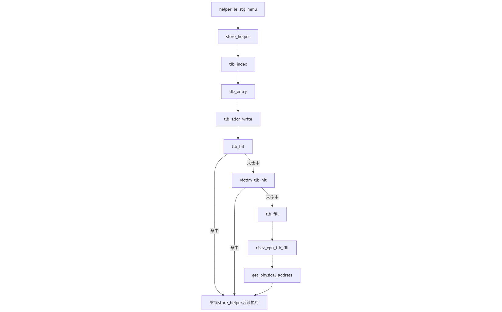
该图与前面开启虚拟空间的存储指令对比分析，仅一处函数调用不同：之前分析的是 sb（Store Byte，1 字节），因此调用`helper_ret_stb_mmu`；当前分析的是`sd（Store Doubleword，8 字节）`，因此调用`helper_le_stq_mmu`。QEMU 根据访存指令的数据大小选择对应的 helper 函数，sb 用 1 字节 helper，sd 用 8 字节 helper，这是 TCG 翻译机制的正常行为。执行路径上的关键不同在于get_physical_address函数中的switch(vm)分支的执行，详见后续调试分析

下面的调试过程对应上面图片中的执行路径分析(对于riscv_cpu_tlb_fill和get_physical_address的调用可见下面区别部分的调试过程演示)。
```
(gdb) next
1505        uintptr_t index = tlb_index(env, mmu_idx, addr);
(gdb) next
1506        CPUTLBEntry *entry = tlb_entry(env, mmu_idx, addr);
(gdb) next
1507        target_ulong tlb_addr = tlb_addr_write(entry);
(gdb) next
1508        const size_t tlb_off = offsetof(CPUTLBEntry, addr_write);
(gdb) next
1509        unsigned a_bits = get_alignment_bits(get_memop(oi));
(gdb) next
1513        if (addr & ((1 << a_bits) - 1)) {
(gdb) next
1519        if (!tlb_hit(tlb_addr, addr)) {
(gdb) next
1520            if (!victim_tlb_hit(env, mmu_idx, index, tlb_off,
(gdb) next
1522                tlb_fill(env_cpu(env), addr, size, MMU_DATA_STORE,
(gdb) next
1524                index = tlb_index(env, mmu_idx, addr);
(gdb) next
1525                entry = tlb_entry(env, mmu_idx, addr);
(gdb) next
1527            tlb_addr = tlb_addr_write(entry) & ~TLB_INVALID_MASK;
(gdb) next
1531        if (unlikely(tlb_addr & ~TARGET_PAGE_MASK)) {
(gdb) next
1563        if (size > 1
(gdb) next
1564            && unlikely((addr & ~TARGET_PAGE_MASK) + size - 1
(gdb) next
1606     do_aligned_access:
(gdb) next
1607        haddr = (void *)((uintptr_t)addr + entry->addend);
(gdb) next
1608        switch (size) {
(gdb) next
1627            if (big_endian) {
(gdb) next
1630                stq_le_p(haddr, val);
(gdb) next
1632            break;
(gdb) next
helper_le_stq_mmu (env=0x619a081fd030, addr=2149605376, val=0, oi=49, retaddr=124637136548162)
    at /home/fzx/opt/riscv/qemu-4.1.1/accel/tcg/cputlb.c:1673
1673    }
(gdb) next
0x0000715b583ff142 in code_gen_buffer ()
```
关键的执行路径上的区别在于如下所示的`get_physical_adddress`函数内部的`switch (vm)`部分。

之前的执行是在开启虚拟地址空间后（Sv39 模式），vm = 8 表示 Sv39，switch (vm) 匹配到 Sv39 分支，设置 levels = 3（三级页表）、ptidxbits = 9（每级索引 9 位）、ptesize = 8（PTE 8 字节），随后会进行三级页表遍历等并最终提取物理地址。

当前执行是在物理地址模式下（虚拟地址空间未开启），satp 寄存器的 MODE 字段为 0，get_physical_address 在 switch (vm) 中匹配到物理地址模式分支，直接执行 *physical = addr 将addr直接赋值给物理地址，表示在物理地址模式下虚拟地址等于物理地址，无需页表转换，随后第198行代码将内存页面的访问权限设置为可读、可写、可执行，通过位或运算组合 PAGE_READ、PAGE_WRITE 和 PAGE_EXEC 三个标志位，表示该页面具有完整权限。最后return TRANSLATE_SUCCESS，无需页表遍历。

两种模式的核心区别在于：物理地址模式直接返回，Sv39 模式需要完整的页表遍历过程。

对应的调试过程如下所示：
```
(gdb) step
get_physical_address (env=0x605ffef3b030, physical=0x791a8577c290, prot=0x791a8577c284, addr=2149605376, 
    access_type=1, mmu_idx=1) at /home/fzx/opt/riscv/qemu-4.1.1/target/riscv/cpu_helper.c:158
158     {
(gdb) step
163         int mode = mmu_idx;
(gdb) step
165         if (mode == PRV_M && access_type != MMU_INST_FETCH) {
(gdb) next
171         if (mode == PRV_M || !riscv_feature(env, RISCV_FEATURE_MMU)) {
(gdb) next
177         *prot = 0;
(gdb) next
181         int mxr = get_field(env->mstatus, MSTATUS_MXR);
(gdb) next
183         if (env->priv_ver >= PRIV_VERSION_1_10_0) {
(gdb) next
184             base = get_field(env->satp, SATP_PPN) << PGSHIFT;
(gdb) next
185             sum = get_field(env->mstatus, MSTATUS_SUM);
(gdb) next
186             vm = get_field(env->satp, SATP_MODE);
(gdb) next
187             switch (vm) {
(gdb) next
197                 *physical = addr;
(gdb) next
198                 *prot = PAGE_READ | PAGE_WRITE | PAGE_EXEC;
(gdb) next
199                 return TRANSLATE_SUCCESS;
(gdb) next
353     }
(gdb) next
riscv_cpu_tlb_fill (cs=0x605ffef32620, address=2149605376, size=8, access_type=MMU_DATA_STORE, mmu_idx=1, 
    probe=false, retaddr=133154815336770) at /home/fzx/opt/riscv/qemu-4.1.1/target/riscv/cpu_helper.c:453
453         if (mode == PRV_M && access_type != MMU_INST_FETCH) {
(gdb) next
459         qemu_log_mask(CPU_LOG_MMU,
(gdb) next
463         if (riscv_feature(env, RISCV_FEATURE_PMP) &&
(gdb) next
465             !pmp_hart_has_privs(env, pa, size, 1 << access_type, mode)) {
(gdb) next
464             (ret == TRANSLATE_SUCCESS) &&
(gdb) next
468         if (ret == TRANSLATE_PMP_FAIL) {
(gdb) next
471         if (ret == TRANSLATE_SUCCESS) {
(gdb) next
472             tlb_set_page(cs, address & TARGET_PAGE_MASK, pa & TARGET_PAGE_MASK,
(gdb) next
474             return true;
(gdb) next
495     }
(gdb) next
tlb_fill (cpu=0x605ffef32620, addr=2149605376, size=8, access_type=MMU_DATA_STORE, mmu_idx=1, 
    retaddr=133154815336770) at /home/fzx/opt/riscv/qemu-4.1.1/accel/tcg/cputlb.c:879
879         assert(ok);
(gdb) next
880     }
(gdb) next
store_helper (big_endian=false, size=8, retaddr=133154815336770, oi=49, val=0, addr=2149605376, 
    env=0x605ffef3b030) at /home/fzx/opt/riscv/qemu-4.1.1/accel/tcg/cputlb.c:1524
1524                index = tlb_index(env, mmu_idx, addr);
```
### 5.2 qemu中模拟出来的tlb与真实cpu中的tlb逻辑上的区别分析
##### 在物理地址模式下的行为差异
在物理地址模式下（虚拟地址空间未开启），真实 CPU 的硬件 TLB 不参与地址转换。当 satp.MODE = 0 时，MMU 硬件被禁用，地址直接作为物理地址使用，硬件层面不访问 TLB 电路。这是 RISC-V 特权规范规定的行为：MBARE 模式下 MMU 被禁用，所有地址被视为物理地址，不进行地址转换，因此硬件 TLB 不参与。而 QEMU 的软件 TLB 在物理地址模式下仍然会执行 TLB 查找、调用 get_physical_address 进行地址转换（虽然函数内部会快速返回 *physical = addr），并调用 tlb_set_page 填充 TLB 条目，将虚拟地址到物理地址的直接映射（1:1 映射）缓存到 TLB 中。这体现了软件模拟的统一处理方式：为了代码复用和维护，所有模式都走相同的代码路径，通过条件判断区分行为，而不是像硬件那样在物理地址模式下完全禁用 TLB。
##### 在虚拟地址模式下的实现差异
在虚拟地址模式下（如 Sv39），真实 CPU 的硬件 TLB 是专用的高速缓存电路，通过硬件并行查找实现极低延迟的地址转换，TLB 未命中时会触发硬件页表遍历单元（Page Table Walker）自动进行多级页表遍历，整个过程由硬件自动完成，无需软件干预。而 QEMU 的软件 TLB 是通过数据结构（CPUTLBEntry 数组）和函数调用实现的，TLB 查找通过计算索引、访问数组、比较地址标记等软件操作完成，TLB 未命中时通过调用 get_physical_address 函数进行软件层面的页表遍历，包括读取 PTE、检查权限、计算物理地址等步骤，整个过程由软件代码执行，存在函数调用开销和条件判断开销。
##### 统一性与灵活性的权衡
真实 CPU 的硬件 TLB 可以在不同模式下采用不同的硬件路径，物理地址模式下可以完全绕过 TLB，虚拟地址模式下使用 TLB 加速，这种灵活性是硬件设计的优势。而 QEMU 的软件 TLB 采用统一的代码路径处理所有模式，物理地址模式和虚拟地址模式都经过相同的 store_helper → tlb_fill → get_physical_address 调用链，只是 get_physical_address 内部根据模式选择不同的处理逻辑（快速返回或页表遍历），这种统一性简化了代码维护，但带来了额外的软件开销，即使在不需地址转换的情况下也要执行检查代码。
##### 总结
真实 CPU 的硬件 TLB 是专用硬件，在物理地址模式下可能不参与，在虚拟地址模式下通过硬件并行查找和自动页表遍历实现高效转换。QEMU 的软件 TLB 是软件数据结构，为了统一处理，即使在物理地址模式下也会查找和填充 TLB，在虚拟地址模式下通过软件函数调用进行页表遍历，这种设计体现了软件模拟在灵活性和性能之间的权衡。
## 6.实验过程中的大模型辅助记录
在这个调试任务中，遇到的比较大的一个疑惑是sudo gdb与make gdb中的gdb是不是指的同一个，因为在初期make gdb可以执行，但是sudo gdb的执行会报错，就此疑惑附上指导书对三个终端的要求询问大模型后得知这两个gdb并不相同，sudo gdb用于调试 QEMU 本身即qemu源码，而make gdb是调试 QEMU 内运行的 RISC-V 内核，也就是我们一直在写的内核代码；之后使用大模型给的指令安装了sudo gdb所需的gdb，最后成功开启了调试过程.

# 分支任务:gdb 调试系统调用以及返回

## 1、ecall指令的模拟执行观测

### 1.1 调试断点策略与定位

为了深入探究系统调用的硬件模拟机制，本次实验采用“双重调试”策略。这意味着我们需要在被模拟的客户机系统（Guest OS, 即 ucore）和模拟器宿主程序（Host Emulator, 即 QEMU）中分别设置关键断点以构建一个精确的观测窗口，捕捉从用户态（U-Mode）陷入内核态（S-Mode）的瞬间。

具体的断点设置策略如下：

1. **Guest 端断点（ucore 视角）** ：将 ucore 的执行流定格在用户态程序发起特权级切换指令（ecall）的前一刻。

    - **具体位置**：用户态核心库函数 `syscall`​，所有的系统调用（如 `sys_exit`​, `sys_fork`​）最终都会调用该函数进行分发。具体在`user/libs/syscall.c`​ 文件中内联汇编代码块内的 **​`ecall`​**​ **指令**。
    - **具体操作**：由于 GDB 默认仅加载内核符号表，调试前需通过 `add-symbol-file`​ 手动加载用户程序（如 `obj/__user_exit.out`​）的符号表，并通过反汇编（`disassemble`​）指令获取 `ecall` 在内存中的确切物理地址以设置指令级断点。
2. **Host 端断点（QEMU 视角）** ：捕获模拟器响应 RISC-V 架构异常信号、模拟硬件状态机流转的入口函数。

    - **具体位置**：QEMU 源码中负责处理 RISC-V 中断与异常的核心辅助函数（Helper Function）。具体在`target/riscv/cpu_helper.c`​ 文件中的 **​`riscv_cpu_do_interrupt`​**​ **函数**。该函数是 QEMU 模拟硬件中断行为的“总闸”。当 Guest 端执行 `ecall`​ 指令触发同步异常时，QEMU 的执行流将跳转至此函数，通过软件逻辑修改虚拟 CPU 的结构体成员（如 `pc`​, `sepc`​, `scause`​, `mstatus` 等）来模拟真实的硬件行为。在此处设置断点，即可对模拟器的内部状态进行详细观察。

### 1.2 调试流程及观察结论

##### 1.2.1 双重调试环境构建与目标指令定位

为了观测系统调用的硬件模拟细节，首先构建了由三个终端协同工作的双重调试环境，具体操作步骤如下：

1. **启动模拟器（终端 T1）** ：  
    执行 `make debug` 命令启动带有调试信息的 QEMU，此时 QEMU 完成 OpenSBI 的加载后处于暂停状态，并在后台监听 1234 端口等待 Guest 端 GDB 的连接。
2. **挂载 Host 端调试器（终端 T2）** ：  
    为了观测 QEMU 自身的运行逻辑，首先使用 `pgrep -f qemu-system-riscv64`​ 获取当前 QEMU 进程的 PID（如图中所示为 4278）。随后启动主机版 GDB 并执行 `attach 4278`​ 附身到该进程。为了防止 GDB 与 QEMU 通信过程中因信号干扰中断调试，执行 `handle SIGPIPE nostop noprint`​ 屏蔽管道断裂信号。最后输入 `c` (continue)，让 QEMU 恢复运行，准备响应 Guest 端的指令。
3. **连接 Guest 端调试器并定位 ecall（终端 T3）** ：  
    启动 `riscv64-unknown-elf-gdb`​ 连接到 ucore 内核。由于本次调试的目标位于用户态程序中，默认的内核符号表无法覆盖，因此执行 `add-symbol-file obj/__user_exit.out`​ 手动加载用户程序 `exit` 的符号表。

    加载符号后，在用户库函数的系统调用接口处设置断点 `b user/libs/syscall.c:18`​。输入 `c`​ 继续执行，ucore 随即完成启动并运行用户程序，最终停在 `syscall`​ 函数入口。此时，使用 `x/8i $pc`​ 查看当前指令附近的汇编代码，成功定位到触发系统调用的关键指令 **​`ecall`​**​ 位于内存地址 **​`0x800100`​** 处。这一步为后续精准捕获硬件异常行为奠定了基础。

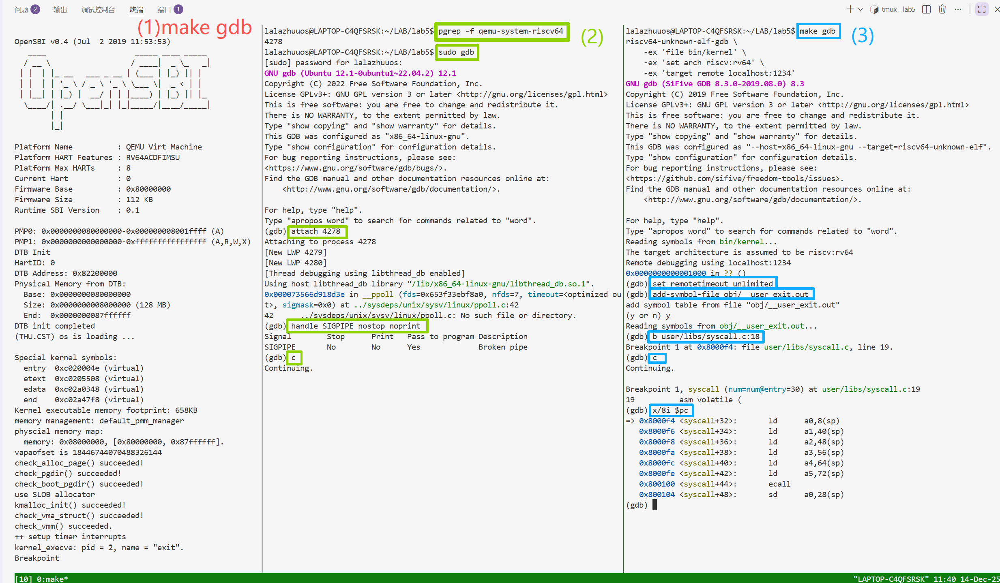

##### 1.2.2 单步执行到ecall并在模拟器设置断点

在定位到目标指令后，为了避免捕捉到无关的中断（如时钟中断）并确保能精准观测到 `ecall` 的执行瞬间，采取了以下操作：

1. **Guest 端单步执行到ecall（终端 T3）** ：  
    在 ucore 调试端，连续执行 `si`​（单步指令）命令，精细控制 CPU 的执行流。如图所示，程序计数器从 `0x8000f6`​ 逐步递增，经过一系列参数加载指令后，最终成功让 ucore 停留在 **​`0x800100`​**​ 地址处。此时，CPU 指针正指向 **​`ecall`​** 指令，但尚未执行。
2. **Host 端设置断点（终端 T2）** ：  
    在确认 Guest 端已就位后，切换至 QEMU 调试端。按下 `Ctrl+C`​ 暂停 QEMU 的运行，随即执行 `b riscv_cpu_do_interrupt`​。该函数是 QEMU 处理所有 RISC-V 异常和中断的入口，在此处设防可以确保一旦 `ecall`​ 执行引发同步异常，GDB 能立即中断 QEMU 的模拟循环。设置完成后输入 `c`，使 QEMU 恢复运行状态等待异常触发。

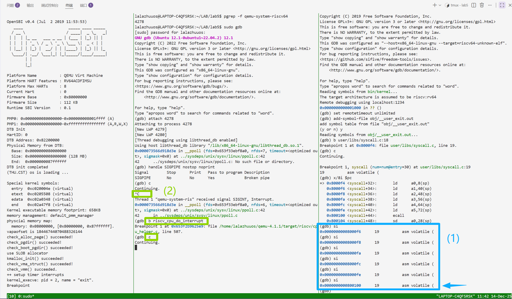

##### 1.2.3 触发系统调用与模拟器捕获

在完成双端部署后，进行了最终的指令触发与异常捕获操作：

1. **指令触发（终端 T3）** ：  
    在 ucore 调试端输入 `si`​ 命令。这一指令不仅是汇编层面的“单步执行”，更是触发硬件行为的开关。CPU 执行位于 `0x800100`​ 的 `ecall` 指令，该指令在 RISC-V 架构定义中用于从用户态向内核态发起请求，这会立即引发一个同步异常。
2. **异常捕获（终端 T2）** ：  
    就在 T3 执行 `si`​ 的瞬间，Host 端 GDB 立即响应并中断了 QEMU 的运行。如图中高亮区域所示，GDB 输出 `Thread 3 ... hit Breakpoint 1, riscv_cpu_do_interrupt ...`​。这表明 QEMU 在模拟执行 `ecall`​ 指令时，正确地跳转到了预设的 C 语言辅助函数 `riscv_cpu_do_interrupt`。

    这一现象直观地验证了模拟器的工作机制：用户态的汇编指令 `ecall` 在模拟器底层被转化为对特定 C 函数的调用，以软件逻辑模拟硬件的中断处理流程。此时，ucore 的执行被冻结在进入内核态的边界上，我们成功进入了 QEMU 模拟硬件的内部视角。

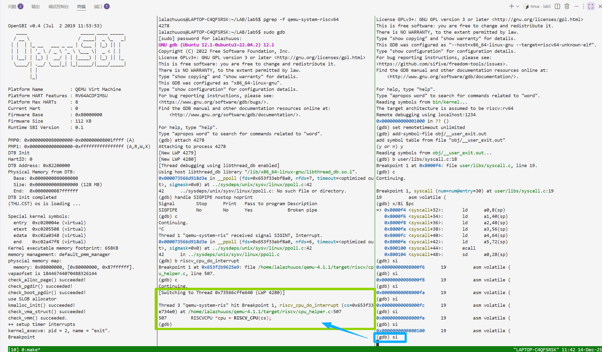

##### 1.2.4 异常上下文验证与分发逻辑确认

在 QEMU 暂停于 `riscv_cpu_do_interrupt` 函数入口后，为了确认捕获到的异常确系用户态系统调用，在 Host 端 GDB 中进行了如下验证操作：

1. **单步跟踪初始化流程**：  
    由于断点位于函数起始处，局部变量尚未初始化，直接查看会导致读取到无效数据（如图中 `$1`​ 所示的随机值）。因此，连续执行 `n`​ (next) 命令，单步跳过变量声明与初始化代码（包括 `env`​ 指针获取、`async`​ 标志位解析以及 `cause`​ 提取等逻辑），直至执行流停在判断异常委托的 `if (env->priv <= PRV_S ...)` 语句处。
2. **关键状态校验**：  
    在此处检查模拟 CPU 的内部状态：

    - 执行 `p cause`​，结果为 **​`8`​**​。在 RISC-V 规范中，Exception Code 8 对应 **Environment call from U-mode**，这证实了当前处理的确是用户态发起的系统调用请求。
    - 执行 `p env->priv`​，结果为 **​`0`​**​。这代表当前 CPU 的特权级（Privilege Level）为 **User Mode**，与预期完全一致。
3. **分发路径确认**：  
    代码当前的执行位置位于 `if`​ 判断语句，该判断用于决定异常是否由 S 态（内核）处理。由于当前特权级（0）小于等于 S 态，且 `cause`​ (8) 对应的委托位（`deleg`​）通常被置位，代码逻辑将进入 `if` 分支内部。这意味着模拟器即将执行从用户态到内核态的上下文切换逻辑，而非交由 M 态（OpenSBI）处理。通过这一步验证，排除了时钟中断或 M 态异常的干扰，锁定了核心调试目标。

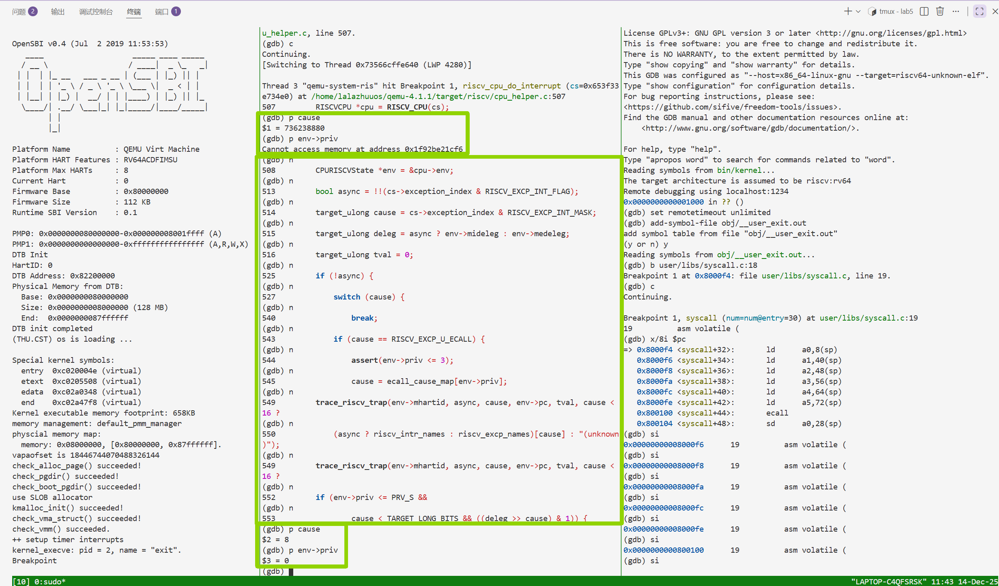

##### 1.2.5 硬件状态更新与控制流切换的完整观测

进入 S 态异常处理逻辑分支后，通过单步调试（`n`）依次执行了关键的 CSR 寄存器更新代码，并对每一次状态变更进行了验证，从而完整复现了 RISC-V 硬件响应系统调用的物理过程：

1. **状态寄存器更新（mstatus/sstatus）** ：  
    执行完 `env->mstatus = s`​ 后，查看 `env->mstatus`​ 的值为 `0x...46020`​。分析其二进制位可知，**SPP (Supervisor Previous Privilege)**  位被置为 **0**，正确记录了异常发生前 CPU 处于 User 态；同时 **SIE (Supervisor Interrupt Enable)**  位被置为 **0**，表明进入内核态时硬件自动关闭了中断，以防止异常处理过程被打断。
2. **现场保存与原因记录（sepc & scause）** ：  
    继续执行，观测到 `env->scause`​ 被写入 **​`0x8`​**​，再次确认了异常类型。更为关键的是，`env->sepc`​ 被更新为 **​`0x800100`​**​。这一地址与 Guest 端（T3）反汇编中看到的 `ecall`​ 指令地址完全一致，证明模拟器成功保存了系统调用指令的地址，为后续操作系统执行 `sret` 指令返回用户态提供了依据。
3. **控制流跳转（pc）** ：  
    在执行完 PC 更新逻辑后，`env->pc`​ 的值瞬间从用户空间的 `0x800100`​ 变更为 **​`0xffffffffc0200e4c`​**​。该地址属于内核高地址空间，对应着 `stvec`​ 寄存器指向的中断向量表入口（即 ucore 的 `__alltraps` 汇编入口）。这一步标志着控制流正式移交给操作系统内核。
4. **特权级切换（priv）** ：  
    最后，执行 `riscv_cpu_set_mode(env, PRV_S)`​。再次检查 `env->priv`​，其值由之前的 0 变为 **​`1`​**（Supervisor Mode）。至此，QEMU 完成了所有硬件行为的模拟，CPU 正式进入内核态，拥有了执行特权指令和访问内核资源的权限。


##### 调试结论

通过本次双重 GDB 调试实验，清晰地观测到了 `ecall`​ 指令的是模拟器通过精确修改虚拟 CPU 结构体中的 `pc`​、`sepc`​、`scause`​、`mstatus`​ 及 `priv` 等成员变量，严格遵循 RISC-V 特权级规范实现的软件逻辑，这验证了系统调用机制在硬件模拟层面的具体实现细节。

### 1.3 源码剖析与指令翻译机制分析

##### 1.3.1 QEMU 中断处理核心逻辑分析

通过调试我们确认，当 Guest 端 CPU 执行 `ecall`​ 指令时，Host 端 QEMU 会调用 `target/riscv/cpu_helper.c`​ 中的 `riscv_cpu_do_interrupt` 函数来模拟这一硬件行为。以下是该函数的关键源码（已略去无关部分）及其逻辑分析：

```c
void riscv_cpu_do_interrupt(CPUState *cs)
{
#if !defined(CONFIG_USER_ONLY)
    RISCVCPU *cpu = RISCV_CPU(cs);
    CPURISCVState *env = &cpu->env;

    // 1. 异常信息提取
    // 从 exception_index 中分离出是中断(async)还是异常(sync)，以及具体的 cause
    bool async = !!(cs->exception_index & RISCV_EXCP_INT_FLAG);
    target_ulong cause = cs->exception_index & RISCV_EXCP_INT_MASK;
    // 获取委托寄存器，决定由 S 态还是 M 态处理
    target_ulong deleg = async ? env->mideleg : env->medeleg;
    target_ulong tval = 0;

    // ... (省略部分 tval 设置代码) ...

    // 2. ECALL 异常号映射
    if (!async) {
        /* ecall is dispatched as one cause so translate based on mode */
        if (cause == RISCV_EXCP_U_ECALL) {
            // 如果是用户态 ecall，根据当前特权级确认 cause。
            // 此时 env->priv 为 0 (User)，故 cause 保持为 8 (RISCV_EXCP_U_ECALL)
            assert(env->priv <= 3);
            cause = ecall_cause_map[env->priv]; 
        }
    }

    // 3. 异常路由判断 (关键分流)
    // 判断条件：当前特权级 <= S 态  且  该异常被委托给了 S 态 (deleg 对应位为 1)
    if (env->priv <= PRV_S &&
            cause < TARGET_LONG_BITS && ((deleg >> cause) & 1)) {
        
        /* handle the trap in S-mode (内核态处理分支) */
        
        // 4. 更新状态寄存器 (Status Register)
        target_ulong s = env->mstatus;
        // SPIE = SIE (保存旧的中断使能状态)
        s = set_field(s, MSTATUS_SPIE, env->priv_ver >= PRIV_VERSION_1_10_0 ?
            get_field(s, MSTATUS_SIE) : get_field(s, MSTATUS_UIE << env->priv));
        // SPP = priv (保存旧的特权级，此时 priv=0，故 SPP=0)
        s = set_field(s, MSTATUS_SPP, env->priv);
        // SIE = 0 (关闭中断)
        s = set_field(s, MSTATUS_SIE, 0);
        env->mstatus = s; // 写回状态

        // 5. 记录异常原因与现场
        env->scause = cause | ((target_ulong)async << (TARGET_LONG_BITS - 1));
        env->sepc = env->pc; // 将当前 ecall 指令地址保存到 sepc
        env->sbadaddr = tval;

        // 6. 控制流跳转
        // pc = stvec (中断向量表基址) + 偏移量
        env->pc = (env->stvec >> 2 << 2) +
            ((async && (env->stvec & 3) == 1) ? cause * 4 : 0);
        
        // 7. 特权级切换
        riscv_cpu_set_mode(env, PRV_S); // 切换至 Supervisor Mode
    } else {
        /* handle the trap in M-mode (OpenSBI 处理分支) */
        // ... (省略 M 态处理逻辑) ...
    }
#endif
    cs->exception_index = EXCP_NONE; /* mark handled to qemu */
}
```

**结合调试过程的分析：**

- **异常识别**：代码首先通过 `cause = ecall_cause_map[env->priv]`​ 确认了异常号。在调试中我们观测到 `cause` 为 8，与源码逻辑一致。
- **路由分发**：调试中我们单步跟踪进入了 `if (env->priv <= PRV_S ...)` 分支。这是因为 ucore 运行在 S 态，且 OpenSBI（M 态固件）已经将 User Ecall 异常委托给了 S 态处理。
- **原子性状态更新**：源码中通过一系列 `set_field`​ 操作修改了 `mstatus`​ 的临时变量 `s`​，最后一次性写入 `env->mstatus`​；紧接着更新 `sepc`​ 和 `pc`。这在软件层面模拟了硬件处理异常时的原子性操作，解释了为何我们在 GDB 中能观测到这些寄存器值的同步变化。

##### 1.3.2 TCG 指令翻译机制 (TCG Translation)

在本次实验中，我们在 Guest 端执行的是一条汇编指令 `ecall`​，却能在 Host 端的一个 C 语言函数 `riscv_cpu_do_interrupt`​ 中断，这一机制的背后是 QEMU 的 **TCG (Tiny Code Generator)**  技术。

**1. 动态二进制翻译**  
QEMU 为了提高模拟效率，并非像简单的解释器那样逐条读取 Guest 指令并模拟执行，而是采用**即时编译 (JIT)**  技术。

- **翻译块**：QEMU 将 Guest 端的指令流以基本块（Basic Block）为单位进行翻译。
- **中间码与宿主码**：RISC-V 指令首先被翻译成与架构无关的 TCG 中间码（IR），然后再被编译成宿主机（如 x86_64）的本地机器码直接在物理 CPU 上运行。

**2. 快速路径与慢速路径**

- **快速路径**：对于 `add`​, `sub`​, `lw` 等简单指令，TCG 会直接生成对应的 x86 指令。这些指令执行极快，不涉及复杂的上下文切换，因此在 C 语言源码层面是“不可见”的，无法通过简单的 C 函数断点捕获。
- **慢速路径**：对于 `ecall`​, `sret`​, `csrrw` 等涉及特权级切换、TLB 刷新或中断处理的复杂指令，直接生成 x86 指令过于复杂且难以维护。因此，TCG 会生成一段调用代码，去调用 QEMU 内部预定义好的 C 语言辅助函数（Helper Functions）。

**结论**：  
​`ecall`​ 指令因其触发异常的特性，属于典型的“慢速路径”。当 TCG 翻译到 `ecall`​ 时，它生成了抛出异常的代码，进而触发了 QEMU 的主循环调用 `riscv_cpu_do_interrupt`​ 这一 Helper 函数。这就是我们能够利用双重 GDB 调试，在 C 语言层面抓住一条汇编指令执行过程的根本原因。同理，上一个双重 GDB 实验中调试页表查询（`get_physical_address`），也是因为 TLB Miss 属于需要复杂逻辑处理的慢速路径，从而调用了相应的 C 辅助函数。

##### 

## 2、sret 指令的模拟执行观测

### 2.1 调试断点策略与定位

在完成了对系统调用触发（`ecall`​）的观测后，下一步是观测操作系统如何从内核态安全返回用户态。这一过程由 `sret`（Supervisor Return）特权指令完成。为了捕捉这一瞬间，我们需要调整双重调试的观测点，分别定位到内核的中断返回出口和模拟器的指令处理函数。

具体的断点设置策略如下：

1. **Guest 端断点（ucore 视角）** ：将 ucore 的执行流定格在内核完成系统调用处理、恢复了用户上下文之后，即将执行特权级切换指令的前一刻。

    - **具体位置**：中断处理程序的汇编出口，即从 `trap`​ C 函数返回后的上下文恢复阶段。具体在`kern/trap/trapentry.S`​ 文件中的  **​`__trapret`​**​ 标号末尾（具体为第 177 行的 **​`sret`​**​ **指令**）。
    - **具体操作**：由于系统调用处理涉及控制台输出等耗时操作，不能直接从 `ecall`​ 处单步执行到 `sret`​。策略是先让 ucore 继续运行（`continue`​），使其完成 `sys_putc`​ 等内核逻辑，直至命中我们在 `trapentry.S`​ 设置的硬件断点。此时，内核栈上的寄存器已通过 `RESTORE_ALL`​ 宏恢复到了 CPU 寄存器中，`sepc` 指向了用户态的下一条指令，系统处于待发射状态。
2. **Host 端断点（QEMU 视角）** ：捕获模拟器执行 `sret` 指令时的内部逻辑，观测其如何利用 CSR 寄存器恢复用户态现场。

    - **具体位置**：QEMU 源码中专门用于模拟 RISC-V 特权级返回指令的辅助函数。具体在`target/riscv/op_helper.c`​ 文件中的 **​`helper_sret`​**​ **函数**。
    - **具体操作**：与 `ecall`​ 类似，`sret`​ 也是一条复杂的特权指令，QEMU 通过 TCG 生成对 `helper_sret`​ 的调用来模拟其行为。在该函数入口设置断点，可以让我们在 C 语言层面观测到模拟器如何读取 `sepc`​ 更新程序计数器（PC），以及如何根据 `sstatus` 中的 SPP 位进行特权级降级。

‍

### 2.2 调试流程及观察结论

##### 2.2.1 **锁定中断返回路径与上下文同步**

为了确保观测到的是用户进程 `exit` 的系统调用返回过程，而非内核启动阶段或其他中断的返回（如时钟中断），采取了分步逼近的调试策略：

1. **上下文同步（终端 T3）** ：  
    首先在 Guest 调试端加载用户程序符号表，并让内核运行至 `user/libs/syscall.c` 的断点处。这一步至关重要，它充当了过滤器，确保当前 CPU 的上下文已切换至我们关注的用户进程，并且刚刚完成了一次陷入内核的操作。
2. **定位返回指令（终端 T3）** ：  
    确认处于正确的进程上下文后，在内核的中断返回路径上设置断点：`b kern/trap/trapentry.S:177`​，该位置对应 `__trapret`​ 代码段的末尾，即 **​`sret`​** 指令的具体地址。
3. **执行至发射点（终端 T3）** ：  
    输入 `c`​ (continue) 让内核继续运行。ucore 随即完成了系统调用的具体服务逻辑（如字符输出），并执行了 `RESTORE_ALL`​ 宏，从内核栈中恢复了 `sstatus`​、`sepc` 以及所有通用寄存器。

    如图所示，Guest 端 GDB 最终精准停留在 **​`0xffffffffc0200f12`​**​ 地址处，当前指令显示为 **​`sret`​**。此时，内核已完成了所有准备工作，CPU 正处于从内核态跨越回用户态的临界点，只待执行这条特权指令。

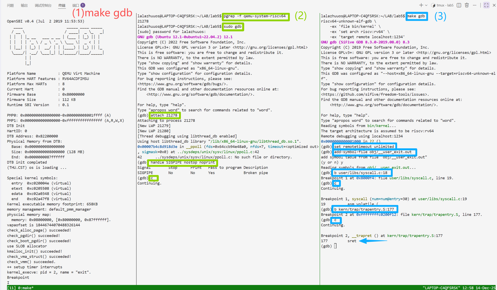

##### 2.2.2 **模拟器运行暂停与指令处理函数设置断点**

在 Guest 端精准定位到特权级切换的临界点（`sret` 指令前）后，需要在 Host 端配置拦截机制以捕获该指令的模拟执行过程：

1. **暂停模拟器运行（终端 T2）** ：  
    虽然 Guest 端已被 GDB 挂起，但 QEMU 宿主进程本身仍处于运行状态（等待网络包或定时器等）。在 Host 调试端按下 `Ctrl+C` 强制中断 QEMU 的执行流，使其进入 GDB 交互模式。
2. **设置核心函数断点（终端 T2）** ：  
    执行 `b helper_sret`​ 命令。`helper_sret`​ 是 QEMU TCG（Tiny Code Generator）翻译机制中定义的辅助函数，专门用于在软件层面实现 `sret`​ 指令的复杂语义（如读取 `sepc`​、更新 `pc`​、切换特权级等）。如图中断点信息所示，GDB 确认断点设置在 `target/riscv/op_helper.c`​ 的第 76 行。这意味着当 CPU 执行 `sret` 时，不会直接执行机器码，而是跳转到该 C 函数进行逻辑模拟。
3. **恢复模拟器就绪状态（终端 T2）** ：  
    执行 `c`​ (continue) 命令。此时 QEMU 恢复运行状态，但由于 Guest 端尚未 `sret` 指令，断点尚未触发。

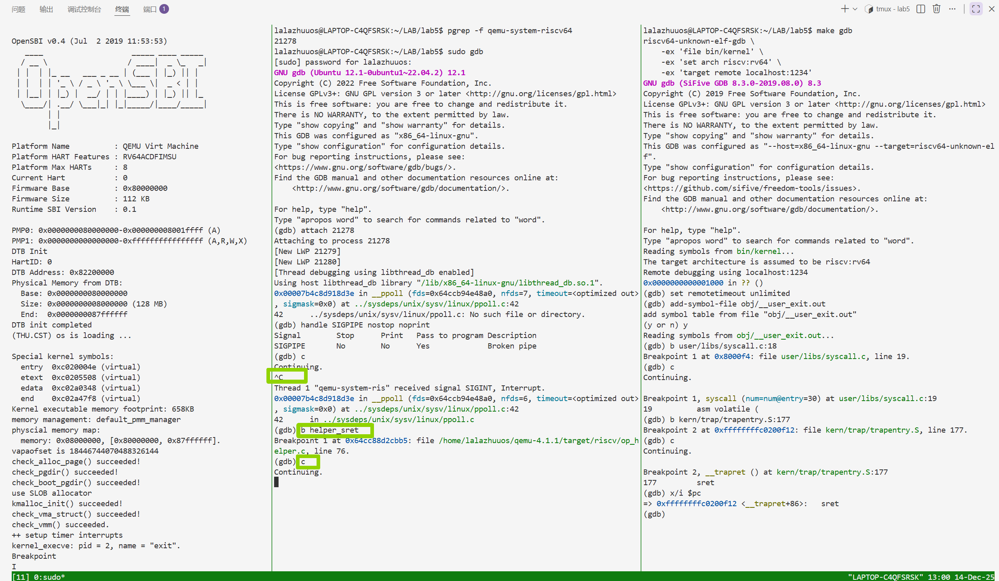

‍

##### 2.2.3 **触发特权级返回与模拟器捕获**

在完成双端部署后，进行了最终的指令触发与异常捕获操作：

1. **指令触发（终端 T3）** ：  
    在 Guest 调试端输入 `si`​ 命令。CPU 执行位于 `kern/trap/trapentry.S`​ 末尾的 `sret` 指令。
2. **模拟器捕获（终端 T2）** ：  
    随着 T3 的指令发出，Host 端 GDB 瞬间响应并中断运行。如图中高亮区域所示，GDB 输出 `Thread 3 ... hit Breakpoint 1, helper_sret ...`​。这表明 QEMU 在处理 `sret`​ 机器码时，并未直接在底层执行硬件指令，而是通过 TCG 机制跳转到了预设的 C 语言辅助函数 `helper_sret`。

    当前断点停留在 `target/riscv/op_helper.c`​ 的第 76 行：`if (!(env->priv >= PRV_S))`​。这是该函数的第一行逻辑，用于检查执行 `sret` 时 CPU 是否处于合法的特权级（必须 >= Supervisor Mode）。至此，我们成功拦截了从内核态返回用户态的关键节点，接下来的调试将揭示硬件寄存器是如何被软件逻辑逐一恢复的。

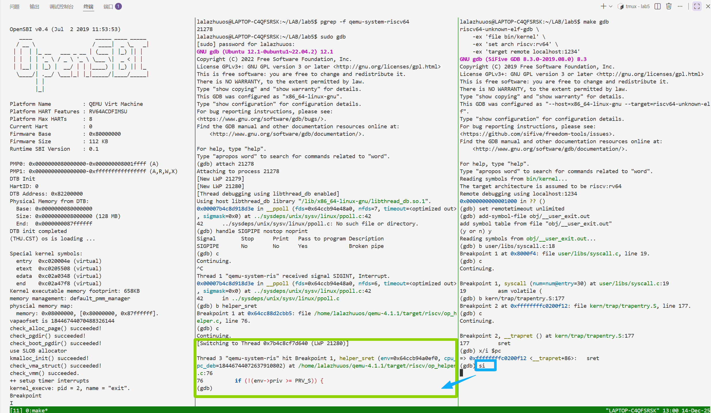

‍

##### 2.2.4 **初始硬件状态校验**

在 QEMU 暂停于 `helper_sret`​ 函数入口后，为了验证 `sret` 指令执行的先决条件是否满足，在 Host 端 GDB 中对关键寄存器的初始值进行了检查：

1. **当前特权级确认（priv）** ：  
    执行 `p env->priv`​，结果为 **​`1`​**​。这代表当前 CPU 处于 **Supervisor Mode**。这是执行 `sret` 指令的必要条件（如果在 User 态执行该指令会触发非法指令异常），证明内核已正确接管了控制权并准备返回。
2. **返回地址确认（sepc）** ：  
    执行 `p/x env->sepc`​，结果为 **​`0x800104`​**​。回顾之前的调试过程，`0x800100`​ 是触发系统调用的 `ecall`​ 指令地址，而 `0x800104`​ 正是其下一条指令的地址。这表明在进入 `sret`​ 处理逻辑之前，内核已经正确维护了 `sepc` 寄存器，为控制流精确跳转回用户程序的下一条指令做好了准备。

这一步验证确认了出发地（S 态）和目的地（用户态地址）的正确性，接下来的单步调试将展示 QEMU 如何利用这些信息完成状态切换。

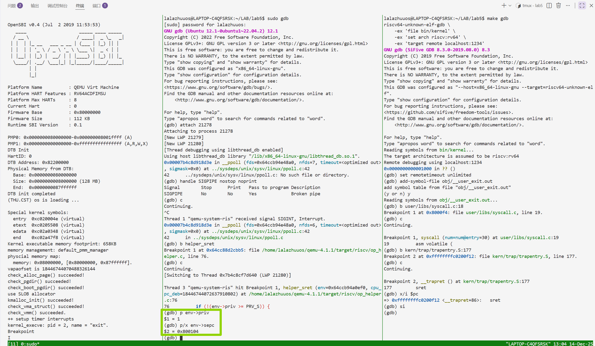

‍

##### 2.2.5 **硬件状态恢复与特权级降级的完整观测**

通过单步调试（`n`​）继续跟踪 `helper_sret` 函数的执行流程，依次验证了硬件在执行中断返回时的关键逻辑步骤，完整复现了特权级切换的物理过程：

1. **获取返回地址（retpc）** ：  
    代码首先执行 `target_ulong retpc = env->sepc;`​。在 GDB 中查看变量 `retpc`​，其值为 **​`0x800104`​**​。这验证了硬件成功从 `sepc` 寄存器中读取了预存的用户态下一条指令地址，确定了控制流的跳转目标。
2. **解析目标特权级（prev_priv）** ：  
    随后，代码通过 `get_field(mstatus, MSTATUS_SPP)`​ 从状态寄存器中提取“之前的特权级”。查看变量 `prev_priv`​，结果为 **​`0`​**​。这表明 `sstatus`​ 的 SPP 位正确记录了此次中断是来自 User 态，因此 `sret` 指令知道应当将 CPU 降级回用户模式。
3. **特权级切换（priv）** ：  
    执行 `riscv_cpu_set_mode(env, prev_priv);`​ 后，再次检查 `env->priv`​，其值由之前的 1 变为 **​`0`​**。这是最关键的一步，标志着 CPU 正式脱离了内核态的最高权限，回归受限的用户态，实现了特权级的安全降级。
4. **状态寄存器写回（mstatus）** ：  
    最后，观测 `env->mstatus`​ 的更新结果为 **​`0x...46002`​**。分析关键位：

    - **SPP (Bit 8)**  为 **0**：硬件自动清除了来源记录，为下一次中断做准备。
    - **SIE (Bit 1)**  为 **1**：中断使能位被恢复（来源于之前的 SPIE），意味着回到用户态后，CPU 重新具备了响应中断的能力。

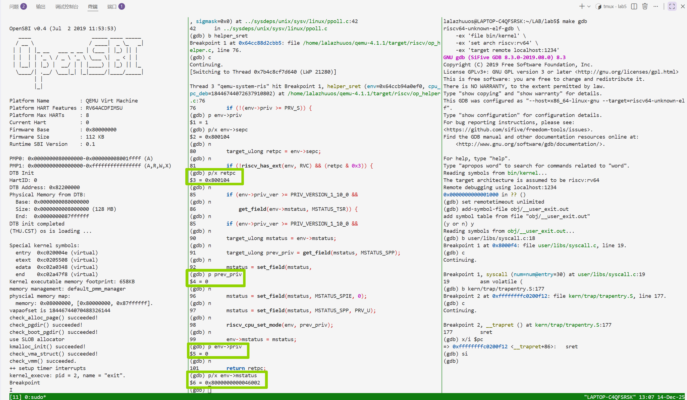

##### 调试结论

通过对 `sret`​ 指令模拟过程的观测，验证了 RISC-V 架构中“中断返回”的硬件实现逻辑：即原子性地从 `sepc`​ 恢复 PC 指针，并依据 `sstatus` 中的 SPP 位恢复特权级和中断使能状态。这一过程在 QEMU 中体现为一系列严密的 C 语言状态机操作，确保了操作系统能安全、准确地将控制权交还给用户进程。

### 2.3 QEMU 中断返回核心逻辑分析

通过调试我们确认，当 Guest 端 CPU 执行 `sret`​ 指令时，Host 端 QEMU 会调用 `target/riscv/op_helper.c`​ 中的 `helper_sret` 函数。该函数模拟了 RISC-V 硬件在执行特权级返回时的原子操作序列。

以下是该函数的源码及其逻辑分析：

```c
target_ulong helper_sret(CPURISCVState *env, target_ulong cpu_pc_deb)
{
    // 1. 合法性检查 (Privilege Check)
    // 只有在 Supervisor 模式或更高特权级下才能执行 sret，否则触发非法指令异常
    if (!(env->priv >= PRV_S)) {
        riscv_raise_exception(env, RISCV_EXCP_ILLEGAL_INST, GETPC());
    }

    // 2. 获取返回地址 (Retrieve Return Address)
    // 从 sepc 寄存器读取先前保存的用户态指令地址
    target_ulong retpc = env->sepc;
    
    // ... (省略部分地址对齐检查与 TSR 检查代码) ...

    // 3. 状态寄存器恢复 (Status Register Restoration)
    target_ulong mstatus = env->mstatus;
    
    // 3.1 获取目标特权级
    // 从 mstatus 的 SPP (Supervisor Previous Privilege) 位读取之前的特权级
    // 在调试中我们观测到 prev_priv 为 0 (User Mode)
    target_ulong prev_priv = get_field(mstatus, MSTATUS_SPP);
    
    // 3.2 恢复中断使能状态
    // 将 SPIE (Previous Interrupt Enable) 的值恢复给 SIE
    // 这意味着回到用户态后，CPU 将恢复响应中断的能力
    mstatus = set_field(mstatus,
        env->priv_ver >= PRIV_VERSION_1_10_0 ?
        MSTATUS_SIE : MSTATUS_UIE << prev_priv,
        get_field(mstatus, MSTATUS_SPIE));
        
    // 3.3 清除状态位
    // SPIE 置 0 (已消耗)
    mstatus = set_field(mstatus, MSTATUS_SPIE, 0);
    // SPP 置为 PRV_U (通常为 0)，为下一次中断做准备
    mstatus = set_field(mstatus, MSTATUS_SPP, PRV_U);
    
    // 4. 特权级切换
    // 将 CPU 当前模式设置为之前读取的 prev_priv (即切换回 User Mode)
    riscv_cpu_set_mode(env, prev_priv);
    
    // 5. 写回状态寄存器
    env->mstatus = mstatus;

    // 6. 返回跳转目标
    // 函数返回 retpc，TCG 会将此值赋给 PC 寄存器
    return retpc;
}
```

**结合调试过程的分析：**

- **执行条件校验**：函数开头的 `if (!(env->priv >= PRV_S))`​ 对应了硬件对特权指令的权限检查。调试中 `priv` 为 1，检查通过。
- **状态回卷**：源码展示了 `mstatus`​ 的“回卷”过程：`SPP`​ -> `Current Priv`​，`SPIE`​ -> `SIE`​。这一过程精确对应了调试中观测到的 `priv`​ 从 1 变 0，以及 `mstatus` 数值的变化。
- **控制流控制**：与 `ecall`​ 处理函数直接修改 `env->pc`​ 不同，`helper_sret`​ 并没有直接修改 `env->pc`​，而是将目标地址 `retpc`​ 作为**返回值**返回。这引出了 TCG 处理跳转指令的特殊机制。

**TCG 翻译机制中的控制流差异 (**​**​`sret`​**​ **vs** **​`ecall`​**​ **)**

虽然 `ecall`​ 和 `sret` 都是通过 Helper Function 实现的慢速路径，但在 TCG (Tiny Code Generator) 的处理机制上存在显著差异，这解释了为什么它们的代码结构不同。

**1. 异常触发型 (**​**​`ecall`​**​ **)：Side Effect**

- **机制**：`ecall`​ 的本质是触发异常。`riscv_cpu_do_interrupt`​ 函数是一个 `void`​ 函数，它通过**副作用 (Side Effect)**  直接修改了 CPU 状态（包括 PC 指针）。
- **流程**：`ecall`​ -> `helper_raise_exception`​ -> QEMU 主循环检测到异常 -> 调用 `riscv_cpu_do_interrupt` 重置 PC。
- **调试表现**：我们在 `do_interrupt`​ 内部看到了 `env->pc` 被修改。

**2. 动态跳转型 (**​**​`sret`​**​ **)：Control Flow Change**

- **机制**：`sret`​ 被 TCG 视为一条改变控制流的跳转指令（类似于 `ret`​ 或 `jmp`​）。`helper_sret`​ 函数是一个**有返回值**的函数，其返回值就是跳转的目标地址。
- **流程**：TCG 生成的代码逻辑大致为：`new_pc = helper_sret(env); cpu->pc = new_pc;`。
- **调试表现**：我们在 `helper_sret`​ 内部只看到了 `sepc`​ 被读取并作为返回值，并没有直接看到 `env->pc` 被赋值。实际的 PC 更新发生在 Helper 函数返回后的 TCG generated code 中。

**结论**：  
通过对比源码分析，我们可以看到 QEMU 在模拟不同类型的特权指令时采用了灵活的策略。对于 `sret`，它利用 C 函数返回值来传递控制流目标，既符合函数调用的语义，也便于 TCG 链接下一个翻译块，从而在保证模拟准确性的同时尽可能优化执行效率。

## 3、实验过程中的大模型辅助记录

在本次双重 GDB 调试实验初期，我最大的困难是在 QEMU 庞大的 C 源码中定位 RISC-V 汇编指令（如 `ecall`​、`sret`​）在模拟器中的具体实现位置。面对 `target/riscv/`​ 目录下大量文件，人工查找效率极低。通过向大模型咨询，我得知 QEMU 通过辅助函数实现复杂指令，并明确定位到 `ecall`​ 异常处理入口函数 `riscv_cpu_do_interrupt`​（位于 `cpu_helper.c`​）以及 `sret`​ 的模拟函数 `helper_sret`​（位于 `op_helper.c`）。基于这些关键信息，我成功在 Host 端 GDB 中快速设置断点，跳过冗长的源码搜索，直接进入核心逻辑的调试与验证阶段，大幅提升了实验效率。
